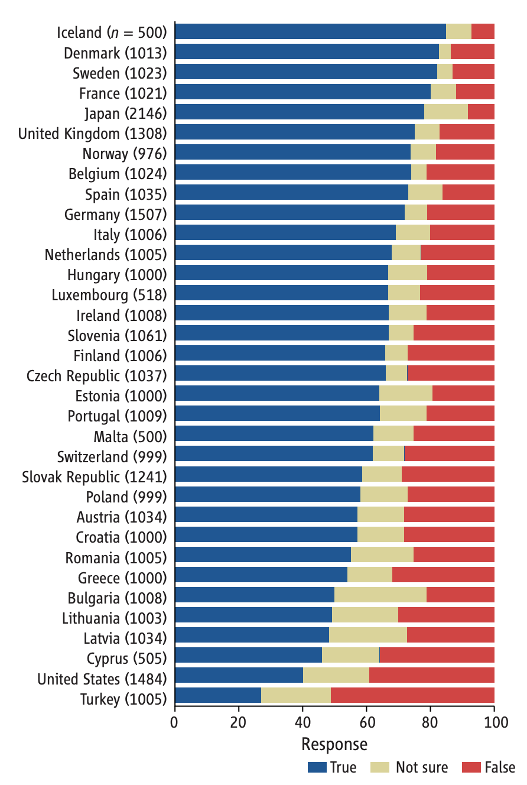

```{r, echo=FALSE}
knitr::opts_chunk$set(
  fig.align = "center",
  echo=FALSE
)
```

## Prelude

<iframe width="560" height="315" src="https://www.youtube.com/embed/j6y1o6woVaY" frameborder="0" allowfullscreen></iframe>

<!-- Gentle Arms of Eden -->

## Prelude

<iframe width="420" height="315" src="https://www.youtube.com/embed/QMshTTIp7SA" frameborder="0" allowfullscreen></iframe>

<!-- Simpson evolution -->

## Announcements

- Exam 2 next Tuesday (no class meeting)

## Today's Topics

- Evolution and U.S. public attitudes
- The evolution of the human brain

# Evolution and U.S. public attitudes

## Public acceptance of evolution {.smaller}

```{r, fig.cap = "[[@miller2006public]](http://dx.doi.org/10.1126/science.1126746)"}

```

## 2021 data {.smaller}

```{r, fig.cap="[[@Miller2021-lb]](http://dx.doi.org/10.1177/09636625211035919)", out.width="700ps"}
knitr::include_graphics("https://journals-sagepub-com.ezaccess.libraries.psu.edu/na101/home/literatum/publisher/sage/journals/content/pusa/2022/pusa_31_2/09636625211035919/20220201/images/medium/10.1177_09636625211035919-fig1.gif")
```

---

> "*A structural equation model indicates that increasing enrollment in baccalaureate-level programs, exposure to college-level science courses, a declining level of religious fundamentalism, and a rising level of civic scientific literacy are responsible for the increased level of public acceptance.*"
>
> [[@Miller2021-lb]](http://dx.doi.org/10.1177/09636625211035919)

## Principles of evolution

- Life forms existing in the Earth's past differed from those living today
- New generations of life forms inherit properties from their predecessors
- New life forms evolved as a result of *mutations*, *selection pressures*, and *geological events* 
- Greater reproductive success (more offspring) for some, not others

## Evidence for evolution

- Fossil
    + Fossil dating (radiometric)
- Geological
    + Where fossils are found relative to one another (relative dating)
    + How long it takes to form layers
    
## Types of evidence

- Molecular
    + Similarities between vastly different species (e.g., in neurotransmitters, receptors, metabolic pathways, etc.) 
- Genetic
    + Rates of mutation
    + Developmental patterns of gene expression
- Anatomical

---

<div class="centered"
<p><a href="https://commons.wikimedia.org/wiki/File:Homology_vertebrates-en.svg#/media/File:Homology_vertebrates-en.svg"></a><br>By Волков Владислав Петрович - <span class="int-own-work" lang="en">Own work</span>, <a href="https://creativecommons.org/licenses/by-sa/4.0" title="Creative Commons Attribution-Share Alike 4.0">CC BY-SA 4.0</a>, <a href="https://commons.wikimedia.org/w/index.php?curid=37704829">Link</a></p>

<!-- Homology -->

</div>

## *Nothing in Biology Makes Sense Except in the Light of Evolution*

> *"Seen in the light of evolution, biology is, perhaps, intellectually the most satisfying and inspiring science. Without that light, it becomes a pile of sundry facts some of them interesting or curious, but making no meaningful picture as a whole."*
    
[[@Dobzhansky1973]](http://dx.doi.org/10.2307/4444260)

## Why Gilmore thinks it's controversial (in the U.S.)

- Contradicts verbatim/non-metaphorical reading of some religious texts
- Makes humans seem less special
- Time scales involved beyond human experience
- Scientific method vs. other ways of knowing
- Found in nature ≠ good for human society

## Why Gilmore thinks it's controversial (in the U.S.)

- Few negative consequences of 'disbelief'
- U.S. culture individualistic, skeptical of experts & [expertise](https://images-na.ssl-images-amazon.com/images/I/51ZrSRpQg9L._SX329_BO1,204,203,200_.jpg)
- Lower levels of religious belief among [U.S. scientists](http://news.rice.edu/2015/12/03/first-worldwide-survey-of-religion-and-science-no-not-all-scientists-are-atheists/)
- [Politics](http://www.people-press.org/2009/07/09/section-4-scientists-politics-and-religion/)

# Evolution of the human brain

## The dawn of time

<div class="centered">

</div>

## History of life on Earth

<div class="centered">
<a href="http://www.zo.utexas.edu/faculty/sjasper/images/26.2.gif">

</a>
</div>

## Cambrian Explosion

<iframe width="560" height="315" src="https://www.youtube.com/embed/qNtQwUO9ff8" frameborder="0" allowfullscreen></iframe>

---

- Complex multicellular lifeforms emerged ~541 million years ago
- "Explosion" in geological terms: lasted ~13-25 million years

## What sparked the explosion? [[@fox_what_2016]](http://doi.org/10.1038/530268a)

- Behavior requires movement through space
- Behavior requires coordinating perception with action
- Behavior requires perception at a distance
- Behavior requires fast & specific communication systems
- Behavior requires **energy**

<!-- ## What behaviors are essential for animals to perform? -->

<!-- - Ingestion -->
<!-- - Defense -->
<!-- - Reproduction -->

<!-- ## What behaviors are essential for animals to perform -->

<!-- - Perception at a distance -->
<!-- - Locomotion -->
<!-- - Object manipulation/consumption -->
<!-- - Signaling/communication -->

<!-- ## How is the nervous system organized to contribute to these behaviors? -->

<!-- <div class="centered"> -->
<!-- <a href="http://larrywswanson.com/wp-content/uploads/2015/06/Willis-on-Steno-circuit.jpg"> -->
<!-- </a> -->
<!-- </div> -->

<!-- ## Cajal -->

<!-- <div class="centered"> -->
<!-- <a href="http://larrywswanson.com/wp-content/uploads/2015/06/Cajal-1893-Reflex.jpg"> -->
<!-- </a> -->
<!-- </div> -->

<!-- ## Swanson/Cajal Four Systems -->

<!-- <div class="centered"> -->
<!-- <a href="http://larrywswanson.com/wp-content/uploads/2015/06/4-systems-network.jpg"> -->
<!-- </a> -->
<!-- </div> -->

## Tree of life

<https://www.evogeneao.com/en/explore/tree-of-life-explorer>

## How nervous systems differ

- Body symmetry
    + radial
    + bilateral
- Segmentation
- Centralized vs. distributed function
- Cephalization: sense organs & nervous system concentrated in anterior
- Encasement in bone (vertebrates)

## [[@arendt_nerve_2016]](http://doi.org/10.1038/nrn.2015.15)

<div class="centered">

</div>

## Cellular/molecular mechanisms

- Similarities in patterns of early nervous system development 
    - across vastly different species
    - with very distant (in time) common ancestors
    - limited number of ways to build nervous systems that successfully regulate behavior

## [[@arendt_nerve_2016]](http://doi.org/10.1038/nrn.2015.15)

<div class="centered">

</div>

## Comparing vertebrate brain structures {.smaller}

<div class="centered">
<a href="http://icb.oxfordjournals.org/content/42/4/743/F2.large.jpg">

</a>

[[@northcutt_understanding_2002]]()
</div>

## Comparing brain structures

- Vertebrates have similar brain plans
- Species differ in relative size of parts

## Brain sizes differ by vertebrate groups {.smaller}

<div class="centered">
<a href="http://icb.oxfordjournals.org/content/42/4/743/F2.large.jpg">

</a>

[[@northcutt_understanding_2002]]()
</div>

## But have similar "slopes"

- Brain sizes scale with body size

## Comparing brain sizes {.smaller}

<div class="centered">
<a href="http://neurosciencelibrary.org/evolution/paleo/images/BrnBodwt6.jpg">

</a>
</div>

## Brain sizes across vertebrate groups

- Brain size scales with body size (more or less)
- Mammals and birds have big brains
- Some animals have big brains for their bodies
    + Humans
    + Crows
    + Porpoises
- Bigger than expect brains (relative to average) = high 'encephalization factor'

## Cortical size within groups {.smaller}

<div class="centered">


[[@hofman_evolution_2014]](http://doi.org/10.3389/fnana.2014.00015)
</div>

## Evolutionary trends in cortical size

| Structural measure | Non-human comparison | Human |
|--------------------|----------------------|-------|
| Cortical gray matter %/tot brain vol | insectivores 25% | 50% |
| Cortical gray + white | mice 40% | 80% |
| Cerebellar mass | primates, mammals 10-15% | 10-15% |
</br>
- Cerebral cortex larger in humans

## Evolutionary trends in cortical size {.smaller}

```{r, fig.cap="[[@rakic2009evolution]](http://dx.doi.org/10.1038/nrn2719)"}
knitr::include_graphics("https://media.springernature.com/full/springer-static/image/art%3A10.1038%2Fnrn2719/MediaObjects/41583_2009_Article_BFnrn2719_Fig1_HTML.jpg?as=webp")
```

[[@rakic2009evolution]](http://dx.doi.org/10.1038/nrn2719)
</div>

## Evolutionary trends in primate brain size

<div class="centered">
<a href="http://www.frontiersin.org/files/Articles/78485/fnana-08-00015-HTML/image_m/fnana-08-00015-g002.jpg">

</a>
</div>

## Evolutionary trends

- In primates, including humans
    + Smaller olfactory bulbs
    + Cerebellum comparable to other mammals
    + Large cerebral cortex

## Selection pressures

- Natural and sexual selection for
    + Traits that improve reproductive success
- Physical AND psychological traits
    + Hardware and software

## Samsung Galaxy S21+

```{r}
knitr::include_graphics("https://i.guim.co.uk/img/media/a947c4e0029eb6fdef0bda96976555fb66497b65/0_246_5456_3273/master/5456.jpg?width=620&quality=45&auto=format&fit=max&dpr=2&s=935b90bf953221b261d7d2e1ad7e2a36")
```

## Virtues of big phones/brains

- More storage
- More processing capacity
- Better sensors
- Better output
- More, better apps
- Do more, faster

## Costs of big brains

- Long time to build
- Lots of energy to nourish/maintain
- Long time to program/train/educate
- Head/neck must be strong enough to carry
- How to connect brain/body parts widely, but process info quickly

<!-- ## Human brains have -->

<!-- - Significant "folding" -->
<!-- - Dense interconnections -->
<!-- - Large "association" areas -->
<!-- - Large cerebral cortex -->
<!-- - High levels of myelination -->

<!-- ## Ways human brains differ -->

<!-- - Larger than body size of comparable mammal -->
<!-- - Large cerebral cortex -->
<!-- - More cortical neurons (~16 billion) -->
<!-- - Large-scale folding (gyri and sulci) -->
<!-- - Large cortical association areas -->
<!--     + Not primary sensory or motor areas -->

## Does size matter? Maybe not so much.


<!-- ## Association areas -->

<!-- <div class="centered"> -->
<!-- <a href="https://upload.wikimedia.org/wikipedia/commons/3/35/Lateral_surface_of_cerebral_cortex_-_gyri.png"> -->
<!--  -->
<!-- </a> -->
<!-- </div> -->
    
## A new view [@Herculano-Houzel2016-oy]

- **Number** of neurons in *cerebral cortex* makes humans "special"

| Species | # cortical neurons | cortical mass (g) |
|---------|--------------------|-------------------|
| Human   | 16 B               | 1233              |
| Chimpanzee | 6 B             | 286               |
| Elephant | 5.6 B             | 2800              |
| Baboon | 2.9 B               | 120.2             |

## A new view [@Herculano-Houzel2016-oy]

| Species | # cortical neurons | cortical mass (g) |
|---------|--------------------|-------------------|
| Giraffe | 1.7 B              | 398.8             |
| Rhesus | 1.7 B               | 69.8              |
| Pig    | 303 M               | 42.2              |
| Rabbit | 71 M                | 4.4               |

## But humans follow typical scaling rules {.smaller}

<div class="centered">
<a href="http://www.pnas.org/content/109/Supplement_1/10661/F3.expansion.html">

</a>

[[@Herculano-Houzel2012-up]](http://doi.org/10.1073/pnas.1201895109)
</div>

## # of cortical (or its equivalent) neurons predicts "cognition"? {.smaller}

<div class="centered">


[[@Herculano-Houzel2017-gf]](http://doi.org/10.1016/j.cobeha.2017.02.004)
</div>
    
## How did the human brain get this way?

- Builds upon mammalian/primate norms
- More efficient energy intake
    + calories/hr foraging vs.
    + cooking?
- Specialized pattern of development
    + Significant time post-natal/pre-reproductive (childhood)
    
## Take homes

- Life forms on Earth have evolved over *billions* of years
- Complex organisims with nervous systems emerged ~500-600 *million* years ago
- Centralized nervous systems have similarities in organization
- Human brains similar to closely related species, but have more neurons in cerebral cortex

## Next time

- Exam 2 on Canvas (start time 3:05 PM)

<!-- Scrolling final reference page -->
<!-- http://stackoverflow.com/q/38260799 -->
<style>
slides > slide { overflow: scroll; }
slides > slide:not(.nobackground):before {
  background: none;
  }
slides > slide:not(.nobackground):after {
  content: '';
  background: none;
  }
}
</style>

## References {.smaller}

