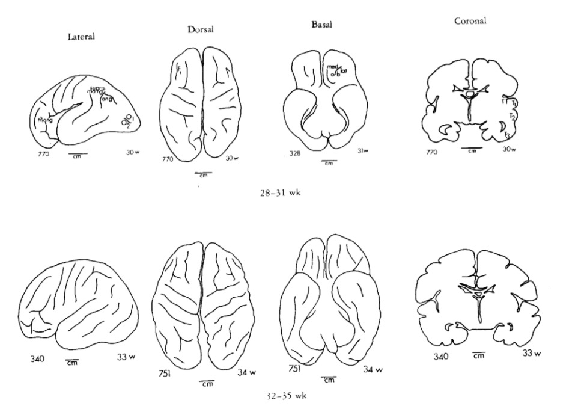
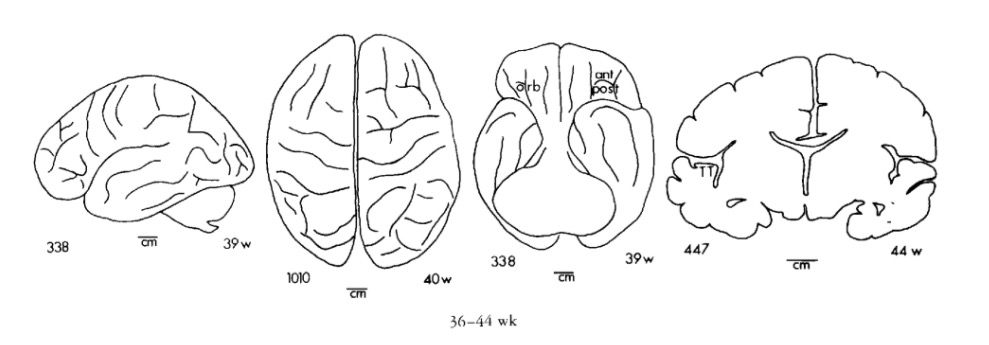

```{r, echo=FALSE}
knitr::opts_chunk$set(
  fig.align = "center",
  echo=FALSE
)
```

<!-- Scrolling final reference page -->
<!-- http://stackoverflow.com/q/38260799 -->
<style>
slides > slide { overflow: scroll; }
slides > slide:not(.nobackground):before {
  background: none;
  }
slides > slide:not(.nobackground):after {
  content: '';
  background: none;
  }
}
</style>

## Prelude 8:01 {.smaller} 

<iframe width="560" height="315" src="https://www.youtube.com/embed/gZpsVSVRsZk" title="YouTube video player" frameborder="0" allow="accelerometer; autoplay; clipboard-write; encrypted-media; gyroscope; picture-in-picture" allowfullscreen></iframe>

[[@Carlsagandotcom2009-im]](https://www.youtube.com/watch?v=gZpsVSVRsZk)

## Today's topic

- How the human brain develops

## Timeline of milestones {.smaller}

```{r, fig.cap="[[@Silbereis2016-la]](http://dx.doi.org/10.1016/j.neuron.2015.12.008)", out.width="95%"}
knitr::include_graphics("https://ars.els-cdn.com/content/image/1-s2.0-S0896627315010806-gr1_lrg.jpg")
```

---

- Brain ~ 2.5% of body mass
    - consumes 18% of $O_2$ at rest, [[@Kety1948-ty]](http://dx.doi.org/10.1172/JCI101994)
    - about 20 W
- CNS among earliest-developing, last to finish organ systems
    - Prolonged developmental period (==childhood) makes CNS especially vulnerable

## Neurons

- ~ 86 billion neurons in adult CNS
    - similar # of glia
- In cortex, about 16 (14-32) billion
    - 80/20% Glu/GABA
- Development generates millions neurons/hr
    
## Synapses

- 7-80K synapses/cortical neuron
- ~ $10^{15}$ (quadrillion) synapses in CNS
- 164 trillion synapses in cerebral cortex, [[@DeFelipe2002-xz]](http://dx.doi.org/10.1023/a:1024130211265)

## Axons

- 145-175 km (90-109 mi) of myelinated axons, [[@Marner2003-qu]](http://dx.doi.org/10.1002/cne.10714)
    
## Prenatal period

- 38 weeks from conception/fertilization on average
- Embryonic period (weeks 1-8), fetal period (weeks 9+)
- Divided into 3 12-13 week trimesters

## Insemination

- Can occur 3-4 days before or up to 1-2 days after...ovulation
- Some animals signal ovulation; humans do not

## Fertilization

- Within ~ 24 hrs of ovulation

## Implantation

- Fertilized ovum implants in wall of uterus
- ~ 6 days after fertilization

## Early embryogenesis

<iframe width="560" height="315" src="https://www.youtube.com/embed/dAOWQC-OBv0" frameborder="0" allowfullscreen></iframe>

## Formation of *neural tube* (neurulation)

```{r, out.width="75%"}
knitr::include_graphics("https://as1.ftcdn.net/jpg/02/52/77/94/500_F_252779434_4Hr3vF8H3wDOH0RslaVw5nLnYoKACiP6.jpg")
```

---

- Embryonic layers: ectoderm, mesoderm, endoderm
    - Neural tube forms ~ 23 pcd (postconceptual days)
- Neural tube closes in middle, moves toward rostral & caudal ends, closing by 29 - 30 pcd.
- Failures of neural tube closure
    + Anencephaly (rostral neuraxis)
    + Spina bifida (caudal neuraxis)
 
## Spina bifida {.smaller}

```{r, fig.cap='https://www.mayoclinic.org/diseases-conditions/spina-bifida/symptoms-causes/syc-20377860'}
knitr::include_graphics("https://www.mayoclinic.org/-/media/kcms/gbs/patient-consumer/images/2013/08/26/11/10/ds00417_im03493_r7_spinabifidababythu_jpg-popup.jpg")
```

## Neural tube becomes...

+ Ventricles & cerebral aqueduct
+ Central canal of spinal cord
  
---

```{r, out.width="50%"}
knitr::include_graphics("https://www.mussenhealth.us/growth-cones/images/2009_48_104-neural-tube-tion.jpg")
```

## Differential growth of vesicles

- Rostro-caudal patterning via differential growth into vesicles
    - Forebrain (prosencephalon)
    - Midbrain (mesencephalon)
    - Hindbrain (rhombencephalon)

## Neurogenesis and gliogenesis

- Neuroepithelium cell layer adjacent to neural tube 
    - creating ventricular zone (VZ) and subventricular zone (SVZ)
- Pluripotent stem and progenitor cells divide, produce new neurons & glia

      
---

```{r, fig.cap="[[@Gotz2005-yj]](https://doi.org/10.1038/nrm1739)"}
knitr::include_graphics("https://media.springernature.com/full/springer-static/image/art%3A10.1038%2Fnrm1739/MediaObjects/41580_2005_Article_BFnrm1739_Fig1_HTML.jpg?as=webp")
```

## Neurogenesis

- Neurogenesis (of excitatory Glu neurons) observed by 27 pcd (7 pcw; post-conceptual week)
    - complete by 191 pcd (27 pcw), [[@Silbereis2016-la]](http://dx.doi.org/10.1016/j.neuron.2015.12.008)
- Most cortical and striatal neurons generated prenatally, but
    - Cerebellum continues neurogenesis ~ 18 mos postnatal mos

## Old (adult) brains new neurons?

- Some animals, yes == songbirds, birds that store food caches
- Humans, on much more limited scale
  - hippocampus
  - striatum
  - olfactory bulb (minimally)
  - not much, if any, in cerebral cortex
- Most neurogenesis occurs near ventricles

---

```{r, fig.cap='[Ernst & Frisen 2015](https://doi.org/10.1371/journal.pbio.1002045)', out.width="90%"}
knitr::include_graphics("https://journals.plos.org/plosbiology/article/figure/image?size=large&id=10.1371/journal.pbio.1002045.g001")
```

## Neural progenitor/stem cells

- Undergo *symmetric* & *asymmetric* cell division
- Generate glia, neurons, and basal progenitor cells

## Radial glia and cell migration

```{r, out.width="75%"}
knitr::include_graphics("img/radial-glia.jpg")
```

---

```{r, out.width="75%"}
knitr::include_graphics("img/neural-tube.jpg")
```

---

<iframe width="420" height="315" src="https://www.youtube.com/embed/ZRF-gKZHINk" frameborder="0" allowfullscreen></iframe>

---

<iframe width="420" height="315" src="https://www.youtube.com/embed/t-8bxeWqSV4" frameborder="0" allowfullscreen></iframe>

## Axon growth cone

<iframe width="420" height="315" src="https://www.youtube.com/embed/Fgmt2RBow0I" frameborder="0" allowfullscreen></iframe>

## Growth cones guided by

- Chemoattractants
    + e.g., Nerve Growth Factor (NGF)
- Chemorepellents
- Receptors in growth cone detect chemical gradients

## Glia migrate, too {.smaller}

```{r, fig.cap="[[@Baumann2001-nw]](http://dx.doi.org/10.1152/physrev.2001.81.2.871)"}
knitr::include_graphics("https://www.physiology.org/na101/home/literatum/publisher/physio/journals/content/physrev/2001/physrev.2001.81.issue-2/physrev.2001.81.2.871/production/images/medium/9j0210133004.jpeg")
```

## Differentiation

- Neuron vs. glial cell
- Cell type
    - myelin-producing vs. astrocyte vs. microglia
    - pyramidal cell vs. stellate vs. Purkinje vs. ...
- NTs released
- Where to connect

# Infancy & Early Childhood

## Synaptogenesis

- Begins prenatally (~ 18 pcw)
- Peak density ~ 15 mos postnatal
- Spine density in prefrontal cortex ~ 7 yrs postnatal
- 700K synapses/s on average

---

```{r, out.width="75%"}
knitr::include_graphics("img/synaptic-density-infant.jpg")
```

## Proliferation, pruning

- Early proliferation (make many synapses)
- Later pruning
- Rates, peaks differ by area

## Apoptosis (programmed cell death)

<iframe src="https://preview.redd.it/6dvk3gw8qik71.gif?format=mp4&s=41d7a053554d502f4ada44d7d512147e50924a22"></iframe>

---

- 20-80%, varies by area
- Spinal cord >> cortex
- Quantity of nerve growth factors (NGF) influences

## Synaptic rearrangement

```{r, out.width="75%"}
knitr::include_graphics("img/huttenlocher.jpg")
```

---

- Progressive phase: growth rate >> loss rate
- Regressive phase: growth rate << loss rate

## Myelination {.smaller}

```{r, fig.cap="[[@Baumann2001-nw]](http://dx.doi.org/10.1152/physrev.2001.81.2.871)", out.width="75%"}
knitr::include_graphics("https://www.physiology.org/na101/home/literatum/publisher/physio/journals/content/physrev/2001/physrev.2001.81.issue-2/physrev.2001.81.2.871/production/images/medium/9j0210133006.jpeg")
```

---

- Neonatal brain largely unmyelinated
- Gradual myelination, peaks <span color="red">in mid-20s</span>
- Non-uniform pattern
    - Spinal cord before brain
    - Sensory before motor
    
## Gyral development (12-19 pcw) {.smaller}

```{r, fig.cap="[[@Chi1977-hm]](http://doi.org/10.1002/ana.410010109)", out.width="75%"}
knitr::include_graphics("img/chi-77-1.jpg")
```

## 20-27 pcw {.smaller}

```{r, fig.cap="[[@Chi1977-hm]](http://doi.org/10.1002/ana.410010109)", out.width="75%"}
knitr::include_graphics("img/chi-77-2.jpg")
```

## 28-35 pcw {.smaller}

```{r, fig.cap="[[@Chi1977-hm]](http://doi.org/10.1002/ana.410010109)", out.width="75%"}

```

## 36-44 pcw {.smaller}

```{r, fig.cap="[[@Chi1977-hm]](http://doi.org/10.1002/ana.410010109)", out.width="75%"}

```

## Structural/morphometric development {.smaller}

<div class="centered">


[[@Knickmeyer2008-vl]](http://doi.org/10.1523/JNEUROSCI.3479-08.2008)
</div>

## Myelination across human development {.smaller}

```{r, fig.cap="[[@Hagmann02112010]](http://doi.org/10.1073/pnas.1009073107)", out.width="75%"}
knitr::include_graphics("https://www.pnas.org/cms/10.1073/pnas.1009073107/asset/ff27c87e-3ed0-4a67-96a2-19ec4ea4c327/assets/graphic/pnas.1009073107fig01.jpeg")
```

## Changes in brain glucose use {.smaller}

```{r, fig.cap="[[@Kuzawa2014-qd]](http://doi.org/10.1073/pnas.1323099111)", out.width="75%"}
knitr::include_graphics("https://www.pnas.org/cms/10.1073/pnas.1323099111/asset/70870a30-89e2-4c59-8472-bd97651c2d2c/assets/graphic/pnas.1323099111fig01.jpeg")
```

## Gene expression across development

```{r, fig.cap="[[@Kang2011-ex]](http://doi.org/10.1038/nature10523)"}
knitr::include_graphics("https://media.springernature.com/full/springer-static/image/art%3A10.1038%2Fnature10523/MediaObjects/41586_2011_Article_BFnature10523_Fig5_HTML.jpg?as=webp")
```

# Summary of developmental milestones

## Prenatal

+ Neuro- and gliogenesis
+ Migration
+ Synaptogenesis begins
+ Differentiation
+ Apoptosis
+ Myelination begins

## Postnatal

+ Synaptogenesis
+ Cortical expansion, activity-dependent change
- Then cubic, quadratic, or linear declines in cortical thickness
+ Myelination
+ Prolonged period of postnatal/pre-reproductive development [[@konner_evolution_2011]](http://www.hup.harvard.edu/catalog.php?isbn=9780674062016)

## Timeline of milestones {.smaller}

```{r, fig.cap="[[@Silbereis2016-la]](http://dx.doi.org/10.1016/j.neuron.2015.12.008)", out.width="95%"}
knitr::include_graphics("https://ars.els-cdn.com/content/image/1-s2.0-S0896627315010806-gr1_lrg.jpg")
```

## References {.smaller}
