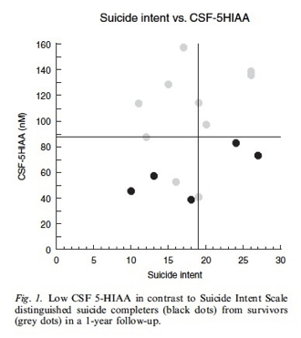
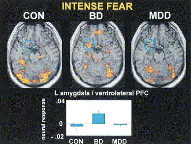
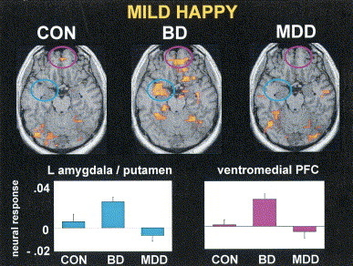
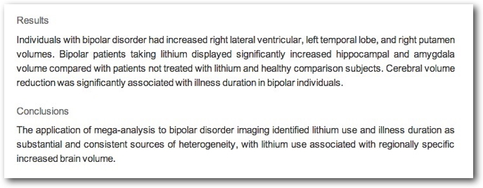

```{r, echo=FALSE}
knitr::opts_chunk$set(
  fig.align = "center",
  echo=FALSE
)
```

<!-- Scrolling final reference page -->
<!-- http://stackoverflow.com/q/38260799 -->
<style>
slides > slide { overflow: scroll; }
slides > slide:not(.nobackground):before {
  background: none;
  }
slides > slide:not(.nobackground):after {
  content: '';
  background: none;
  }
}
</style>

## Prelude {.smaller} 

<iframe width="560" height="315" src="https://www.youtube.com/embed/lioWzrpCtGQ" frameborder="0" allowfullscreen></iframe>

<https://www.youtube.com/embed/lioWzrpCtGQ>

## Today's Topics

- The neuroscience of psychiatric disorders
- Major affective (mood) disorders
    + Major Depressive Disorder (depression)
    + Bipolar Disorder
   
## Serious Mental Illness among Adults in the Past Year {.smaller}

```{r, fig.cap="https://www.samhsa.gov/data/report/2019-nsduh-annual-national-report"}
knitr::include_graphics("https://www.samhsa.gov/data/sites/default/files/reports/rpt29393/2019NSDUHFFRPDFWHTML/images/nsduh-ffr1-fig52-2019.png")
```

## Neuroscience of psychiatric disorders

- Diagnosis via behavior & mood not specific "biomarker"
- Presume diseases of the mind are disorders of the brain
    - System-wide effects; no single or simple cause
    
## Neuroscience of psychiatric disorders

- Heritability
    + *proportion of variance in trait accounted for by genetic factors*
    - Higher for psychiatric disorders than non-psychiatric diseases
    - Family member with mental illness highest known risk factor
    
# Depression

## Major Depressive Disorder

- Symptoms
    + Unhappy mood, insomnia, lethargy, loss of pleasure, interest, energy
- Agitation
- Lasting for several weeks or more

## Symptoms {.smaller}

<div class="centered">
<a href="img/mahar-table-1.jpg">

</a>

[[@mahar_stress_2014]](http://doi.org/10.1016/j.neubiorev.2013.11.009)
</div>

## Depression

- Experienced by ~7% Americans in any year
- Prevalence (up to ~20% lifetime)
    - Females 2-3x males, higher 40+ years of age
- Heritability (large, 2.5 M Swedish population study)
    - Females 0.49 (twins); 0.51 (non-twin relatives)
    - Males 0.41 (twins); 0.36 (non-twin relatives)
    - [[@Kendler2018-cl]](http://doi.org/10.1176/appi.ajp.2018.17111251)

## Neurobiology of Major Depressive Disorder (MDD)

- Reduced sizes of brain regions
- Hypoactivity
- Pharmacological factors
- Synaptic dysfunction

## MDD: Neurological factors

- Reduced hippocampal volumes
- [[@Videbech2004-sm]](http://ajp.psychiatryonline.org/doi/abs/10.1176/appi.ajp.161.11.1957) meta-analysis

## [[@Videbech2004-sm]](http://ajp.psychiatryonline.org/doi/abs/10.1176/appi.ajp.161.11.1957)

<div class="centered">
Left Hippocampus


</div>

## [[@videbech2004hippocampal]](http://dx.doi.org/10.1176/appi.ajp.161.11.1957)

<div class="centered">
Right Hippocampus


</div>

---

<div class="centered">


[[@Palazidou2012-je]](http://dx.doi.org/10.1093/bmb/lds004)
</div>

## MDD: Neurological factors

- *Hypo*activity [[@fitzgerald_meta-analytic_2008]](http://dx.doi.org/10.1002/hbm.20426) in
    + Frontal and temporal cortex
    + Anterior cingulate
    + Insula
    + Cerebellum

## [[@fitzgerald_meta-analytic_2008]](http://dx.doi.org/10.1002/hbm.20426) {.smaller}

<div class="centered">


Row (a) patients v. controls, (b) patients on SSRIs, (c) patients v. ctrls (happy stim), (d) patients v. controls (sad stim)
</div>`

## Neurological factors

- *Hyper*activity [[@Hamilton2012-iv]](https://doi.org/10.1176/appi.ajp.2012.11071105)
    - At baseline: in pulvinar nucleus of thalamus
    - In response to negative stimuli: amygdala, insula, anterior cingulate
- *Hypo*activity
    - In response to negative stimuli: prefrontal cortex, striatum of basal ganglia

## Baseline hyperactivity [[@Hamilton2012-iv]](https://doi.org/10.1176/appi.ajp.2012.11071105)

<div class="centered">
<a href="https://doi.org/10.1176/appi.ajp.2012.11071105">
 
</a>
</div>

## *Hyper/hypo*-activity specific to emotional valence [[@Hamilton2012-iv]](https://doi.org/10.1176/appi.ajp.2012.11071105)

<div class="centered">
<a href="https://doi.org/10.1176/appi.ajp.2012.11071105">

</a>
</div>

## Disrupted connectivity {.smaller}

- Resting state fMRI (rsFMRI) in $n=421$ patients with major depressive disorder and $n=488$ control subjects.
- *Reduced* connectivity between orbitofrontal cortex (OFC) and other areas of the brain
- *Increased* connectivity between lateral PFC and other brain areas

[[@cheng_medial_2016]](http://doi.org/10.1093/brain/aww255)

<!-- ---- -->

<!-- ```{r, fig.cap="[[@cheng_medial_2016]](http://doi.org/10.1093/brain/aww255)"} -->
<!-- knitr::include_graphics("img/cheng-2016-F1.large-1.jpg") -->
<!-- ``` -->

----

```{r, fig.cap="[[@cheng_medial_2016]](http://doi.org/10.1093/brain/aww255)", out.width="900px"}
knitr::include_graphics("img/cheng-2016-F2.large-1.jpg")
```

## MDD: Network of areas implicated

<div class="centered">


[[@Palazidou2012-je]](http://dx.doi.org/10.1093/bmb/lds004)
</div>

<!-- ## Disturbed sleep -->

<!-- - Less slow wave (stage 3 and 4)  -->
<!-- - More REM earlier in night (typical is longer REM as night goes on) -->

<!-- <div class="centered"> -->
<!--  -->
<!-- </div> -->

<!-- ## Pharmacological factors -->

<!-- - Endocrine -->
<!--     + Lowered thyroid function -->
<!--     + High/chronic cortisol levels -->
   
## Pharmacological factors

- Endocrine
    + Thyroid dysfunction [[@Medici2014-pn]](http://dx.doi.org/10.1210/jc.2013-3589)
    + Altered cortisol reactivity [[@Burke2005-ya]](http://dx.doi.org/10.1016/j.psyneuen.2005.02.010)
   
## MDD: Pharmacological factors

- Monoamine hypothesis
    + More: euphoria
    + Less: depression
    + Reserpine (antagonist for NE & 5-HT) can cause depression
    + Low serotonin (5-HT) metabolite levels in CSF of suicidal depressives [[@samuelsson_csf_2006]](http://dx.doi.org/10.1111/j.1600-0447.2005.00639.x)
    
<!-- ## [[@samuelsson_csf_2006]](http://dx.doi.org/10.1111/j.1600-0447.2005.00639.x) -->

<!-- <div class="centered"> -->
<!--  -->
<!-- </div> -->

## Measuring 5-HT

- CSF, platelets, plasma, urine, saliva
- CSF & platelets correlate highly [[@Audhya2012-sv]](http://dx.doi.org/10.1016/j.bbagen.2012.05.012)
- But, salivary 5-HT does not correlate with mood symptoms [[@Leung2018-ks]](http://dx.doi.org/10.1016/j.ymgmr.2018.03.008)

## MDD: Pharmacological factor summary {.smaller}

<div class="centered">


[[@Palazidou2012-je]](http://dx.doi.org/10.1093/bmb/lds004)
</div>

## Treatments for depression

- Psychotherapy
    + Often effective when combined with drug treatment
- Exercise
- Drugs

## Drugs

- Monoamine oxidase (MAO) inhibitors
    + MAO destroys excess monoamines in terminal buttons & glia
    + MAO-I’s boost monoamine levels
- Tricyclics
    + Inhibit NE, 5-HT reuptake
    + Upregulate monoamine levels, but non-selective => side effects
    
## Drugs

- Selective Serotonin Reuptake Inhibitors (SSRIs)
    + Fluoxetine (Prozac, Paxil, Zoloft)
    + Prolong duration of 5-HT in synaptic cleft
    + Also increase brain steroid production
- Selective Serotonin Norepinephrine Reuptake Inhibitors (SNRIs)

## Cymbalta (SNRI)

<iframe width="420" height="315" src="https://www.youtube.com/embed/OTZvnAF7UsA" frameborder="0" allowfullscreen></iframe>

## How well do the drugs work?

- [STAR*D trial](http://www.nimh.nih.gov/funding/clinical-research/practical/stard/allmedicationlevels.shtml)
- On SSRI for 12-14 weeks. ~1/3 achieved remission; 10-15% showed symptom reduction.
- If SSRI didn't work, could switch drugs. ~25% became symptom free.
- 16% of participants dropped out due to tolerability issues
- 6-7 weeks to show response

## Who benefits from drug therapy?

- Depends on
    + Early life stress (ELS)
    + Brain (amygdala) response to emotional faces
- [[@goldstein-piekarski_human_2016]](http://doi.org/10.1073/pnas.1606671113)
    - Low ELS + low amyg reactivity > responding
    - High ELS + high amyg reactivity > responding

----

```{r, fig.cap="[[@goldstein-piekarski_human_2016]](http://doi.org/10.1073/pnas.1606671113)", out.height="500px"}
knitr::include_graphics("https://www.pnas.org/cms/10.1073/pnas.1606671113/asset/86493b5c-f70f-49d9-87e6-2a713d7021a3/assets/graphic/pnas.1606671113fig02.jpeg")
```

## Monoamine hypothesis of depression

- Disrupted (lowered) levels of monoamines (especially NE & 5-HT) result in depression

## Problems with monoamine hypothesis

- Too simplistic
- NE, 5-HT interact
- Drugs fast acting (min), but improvement slow (weeks)

---

> "*No correlation between serotonin and its metabolite 5-HIAA in the cerebrospinal fluid and [11C]AZ10419369 binding measured with PET in healthy volunteers.*" [[@Tiger2015-dy]](http://hdl.handle.net/10616/44513)

---

> "*...we performed the first meta-analysis of the mood effects in [acute tryptophan depletion] ATD and [alpha-methyl-para-tyrosine] APTD studies. The depletion of monoamine systems (both 5-HT and NE/DA) does not decrease mood in healthy controls. However, in healthy controls with a family history of MDD the results suggest that mood is slightly decreased...by [monoamine depletion]...*"

[[@Ruhe2007-qc]](http://dx.doi.org/10.1038/sj.mp.4001949)

## What do drugs do, then?

- Alter receptor sensitivity?
    + 5-HT presynaptic autoreceptors compensate
    + Postsynaptic upregulation of NE/5-HT effects
    
## What do drugs do, then?

- Stimulate neurogenesis?
    + Link to neurotrophin, brain-derived nerve growth factor (BDNF)
    + BDNF boosts neurogenesis
    + SSRIs stimulate growth of new neurons in hippocampus

## Neurogenesis hypothesis, [[@mahar_stress_2014]](http://doi.org/10.1016/j.neubiorev.2013.11.009)

- Chronic stress causes neural loss in hipp
- Chronic stress downregulates 5-HT sensitivity
- Depression ~ chronic stress
- Anti-depressants upregulate neurogenesis via 5-HT modulation

---


[Washington Post, 2019-03-06](https://www.washingtonpost.com/health/2019/03/06/biggest-advance-depression-years-fda-approves-novel-treatment-hardest-cases/)

## Ketamine

- Selective antagonist of the NMDA receptor, an ionotropic glutamate receptor 
- Relieves depressive symptoms relatively quickly [[@Berman2000-vg]](https://www.ncbi.nlm.nih.gov/pubmed/10686270) and [[@Zarate2006-np]](http://dx.doi.org/10.1001/archpsyc.63.8.856)
- Boosts synaptic spine formation [[@Li2010-ve]](http://dx.doi.org/10.1126/science.1190287) and reverses effects of induced stress

## Electroconvulsive Therapy (ECT)

- Last line of treatment for drug-resistant depression
- Electric current delivered to the brain causes 30-60s seizure.
- ECT usually done in a hospital's operating or recovery room  under general anesthesia
- Once every 2 - 5 days for a total of 6 - 12 sessions.

## Electroconvulsive Therapy (ECT)

- Remission rates of up to 50.9% [[@dierckx_efficacy_2012]](http://doi.org/10.1111/j.1399-5618.2012.00997.x)
- Seems to work via
    + Anticonvulsant (block Na+ channel or enhance GABA function) effects
    + Neurotrophic (stimulates neurogenesis) effects

## ECT more effective than Ketamine? {.smaller}

```{r, fig.cap="Fig 3: [[@Ekstrand2021-cq]](http://dx.doi.org/10.1093/ijnp/pyab088)", out.width="750px"}
knitr::include_graphics("https://oup.silverchair-cdn.com/oup/backfile/Content_public/Journal/ijnp/PAP/10.1093_ijnp_pyab088/2/pyab088_fig3.jpeg?Expires=1650372654&Signature=vHS8iH7DVvu35s~WV0UC1x~~B--49hY2X4uab3DUI9qAT0jA0F7bbbE2Dlcvk5BgBoC6AfqTfgXUr67koz1hnhAe5DKgtMJoxOUl9v3ZsHUqvJVxfYOPFkc1HvqZf231oynSVLuXEtuUyjREX-4V1cSVBhM1iJpmkeMrPnfHwehq1Q3FJkaU5E6dtJyAz8rLqeDZEXo4C954Q0nANq6-lw3LlbEiUzXOsDnZPLY~8XW7WuMZAYt5CRxOl7ITUXAnzqTp~7k6HXbPJBTQcriTu2iw1O-LQRdthW8zuVSNOXZrSiaqe8eNX4fJ92q30je2mSNJG2b3MHQ4FO6phmjrmg__&Key-Pair-Id=APKAIE5G5CRDK6RD3PGA")
```

## The promise of deep brain stimuluation

<iframe width="560" height="315" src="https://www.youtube.com/embed/XCY8uQr2LKo" title="YouTube video player" frameborder="0" allow="accelerometer; autoplay; clipboard-write; encrypted-media; gyroscope; picture-in-picture" allowfullscreen></iframe>

## Depression's impact

- Widespread brain dysfunction
- Prefrontal cortex, amygdala, HPA axis, circadian rhythms
- Genetic + environmental factors
- Disturbance in 5-HT, NE systems, cortisol
- Metabolic pathways [[@Pu2020-pb]](http://dx.doi.org/10.1038/s41380-020-0645-4)
- Many sufferers do not respond to available treatments

## Points on depression

- Drug treatments affect neuromodulator NT systems, but
    - Can't effectively measure NT levels
    - Neuromodulators interact, so many side-effects
- 'Monoamine hypothesis' of depression is at-best incomplete

---

- 'Talk' therapies can change behavior/mood by creating new/strengthened circuits
- Emerging therapies (ketamine, deep brain stimulation) show promise, but...

---

> "*Leading biological hypotheses propose that biological changes may underlie major depressive disorder onset and relapse/recurrence. Here, we investigate if there is prospective evidence for biomarkers derived from leading theories. We focus on neuroimaging, gastrointestinal factors, immunology, neurotrophic factors, neurotransmitters, hormones, and oxidative stress....Our search resulted in 67,464 articles*"
>
> [[@Kennis2020-rw]](http://dx.doi.org/10.1038/s41380-019-0585-z)

---

> "*...Only cortisol (N=19, OR=1.294, p=0.024) showed a predictive effect on onset/relapse/recurrence of MDD, but not on time until MDD onset/relapse/recurrence.*"
</br>
</br>
> "*However, this effect disappeared when studies including participants with a baseline clinical diagnosis were removed from the analyses...*"
>
> [[@Kennis2020-rw]](http://dx.doi.org/10.1038/s41380-019-0585-z)

---

> "*...there is a lack of evidence for leading biological theories for onset and maintenance of depression. Only cortisol was identified as potential predictor for MDD, but results are influenced by the disease state. High-quality (prospective) studies on MDD are needed to disentangle the etiology and maintenance of MDD.*"
>
> [[@Kennis2020-rw]](http://dx.doi.org/10.1038/s41380-019-0585-z)

# Bipolar disorder

## Bipolar disorder

- Formerly “manic depression” or “manic depressive disorder"
- Alternating mood states
    + Mania or hypomania (milder form)
    + Depression
- Cycles 3-6 mos in length, but
    + Rapid cycling (weeks or days)
- Suicide risk 20-60x normal population, [[@baldessarini_suicide_2006]](http://dx.doi.org/10.1017/S1092852900014681) 

## Symptoms {.smaller}

<div class="centered">


<http://www.nimh.nih.gov/health/topics/bipolar-disorder/index.shtml>
</div>

## Prevalence, subtypes

- 1-3% lifetime prevalence, subthreshold affects another ~2% [[@Merikangas2007-hu]](Merikangas2007-hu)
- Subtypes
    + **Bipolar I**: manic episodes, possible depressive ones
    + **Bipolar II**: no manic episodes but hypomania (disinhibition, irritability/agitation) + depression

## Related symptoms

- Psychosis (hallucinations or delusions)
- Anxiety, attention-deficit hyperactivity disorder (ADHD)
- Substance abuse

## Genetics

- Overlap between bipolar disorder and schizophrenia
- Genes for voltage-gated Ca++ channels
    + Regulate NT, hormone release
    + Gene expression, cell metabolism
- [[@craddock_genetics_2013]](http://dx.doi.org/10.1016/S0140-6736(13)60855-7)

## Brain responses to emotional faces ≠ depression

<div class="centered">


[[@lawrence_subcortical_2004]](http://dx.doi.org/10.1016/j.biopsych.2003.11.017)
</div>

## [[@lawrence_subcortical_2004]](http://dx.doi.org/10.1016/j.biopsych.2003.11.017)

<div class="centered">

</div>

## [[@lawrence_subcortical_2004]](http://dx.doi.org/10.1016/j.biopsych.2003.11.017)

<div class="centered">

</div>

## Amygdala, hippocampus volume reduced; ventricles larger {.smaller}

<div class="centered">


[[@hallahan_structural_2011]](http://dx.doi.org/10.1016/j.biopsych.2010.08.029)
</div>

## [[@hallahan_structural_2011]](http://dx.doi.org/10.1016/j.biopsych.2010.08.029)

<div class="centered">

</div>

## Drug treatments

- Anti-depressants not especially effective [[@Sidor2012-ki]](http://dx.doi.org/10.1007/s11920-012-0323-6)
- Mood stabilizers
    + Lithium (Li)
    + Valproate (Depakote)
    
---

- Anticonvulsants
    + Usually to treat epilepsy
    + GABA agonists
    + e.g. lamotrigine (Lamictal)
- Atypical antipsychotics

## Lithium "discovered" accidentally

- [John Cade](https://en.wikipedia.org/wiki/John_Cade) discovered in 1948
- Injections of manic patients' urine with a lithium compound (chemical stabilizer) into guinea pig test animals
- Had calming effect
- Earliest effective medications for treating mental illness

## Effects of lithium

- Reduces mania, minimal effects on depressive states
- Preserves PFC, hipp, amyg volumes
- Has other 'neuroprotective' effects [[@Machado-Vieira2009-by]](Machado-Vieira2009-by)

## Effects of lithium

- downregulates DA, glutamate; upregulates GABA
- modulates 5-HT, NE
- *levels can be tested/monitored via blood test*
- [[@malhi_potential_2013]](http://dx.doi.org/10.1007/s40263-013-0039-0)

## Other treatment options

- Psychotherapy
- Electroconvulsive Therapy (ECT)
- Sleep medications

## Prospects

- STEP-BD cohort ($n=1,469$)
    + 58% achieved recovery
    + 49% (of recovered) had recurrences within 2 years
    + Residual depressive symptoms can persist
- [[@Geddes2013-hm]](http://doi.org/10.1016/S0140-6736(13)60857-0)

## An Unquiet Mind

<div class="centered">

</div>

## BP summed-up

- Changes in mood, but ≠ depression
- Genetic + environmental risk
- Changes in emotion processing network activity, size of hippocampus
- Heterogeneous
- No simple link to a specific NT system

## Next time...

- Schizophrenia

## References {.smaller}
