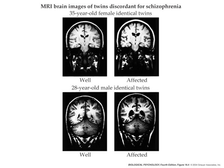

```{r, echo=FALSE}
knitr::opts_chunk$set(echo = FALSE, warning = FALSE, message = FALSE,
                      fig.align = "center",
                      out.width = "600px")
```

## Prelude {.smaller}

<iframe width="420" height="315" src="https://www.youtube.com/embed/-2GmzyeeXnQ" frameborder="0" allowfullscreen></iframe>

2:55

<!-- Ray Davies from The Kinks has bipolar disorder -->

## Today's Topics {data-background=#22de1f}

- Quiz 3 next Tuesday (after class)
- Wrap-up on [bipolar disorder](260-2022-03-15-depression-bipolar.Rmd#49)
- Schizophrenia

## Schizophrenia

<iframe width="420" height="315" src="https://www.youtube.com/embed/gGnl8dqEoPQ" frameborder="0" allowfullscreen></iframe>

## Simulating the Experience

<iframe width="420" height="315" src="https://www.youtube.com/embed/YXimT5CHCDE" frameborder="0" allowfullscreen></iframe>

## Overview

- Lifetime prevalence ~ 1/100
- ~1/3 chronic & severe
- Onset post-puberty, early adulthood
- Pervasive disturbance in mood, thinking, movement, action, memory, perception

## Screening (Yale PRIME test)

1. I think that I have felt that there are odd or unusual things going on that I can’t explain.
2. I think that I might be able to predict the future.
3. I may have felt that there could possibly be something interrupting or controlling my thoughts, feelings, or actions. 

<http://www.schizophrenia.com/sztest/primetest.pdf>

## Screening (continued)

5. I get confused at times whether something I experience or perceive may be real or may be just part of my imagination or dreams. 
6. I have thought that it might be possible that other people can read my mind, or that I can read other’s minds.
7. I wonder if people may be planning to hurt me or even may be about to hurt me.

## Historical background

- Bleuler
    + Coined term “schizophrenia” or “split mind”
    + NOT multiple personality disorder
- Kraeplin
    + Dementia Praecox and Paraphrenia (1919)
    + Emphasized developmental and hereditary origins

## "Positive" symptoms

- “Additions” to behavior
- Disordered thought
- Delusions of grandeur, persecution
- Hallucinations (usually auditory)
- Bizarre behavior

## "Negative" symptoms

- “Reductions” in behavior
- Poverty of speech
- Flat affect
- Social withdrawal
- Impaired executive function
- Anhedonia (loss of pleasure)
- Catatonia (reduced movement)

## Cognitive symptoms

- Memory
- Attention
- Planning, decision-making
- Social cognition
- Movement

## Biological bases

- Genetic disposition
- Brain abnormalities
- Developmental origins

## Genetic disposition

<div class="centered">

</div>

## But, no single gene...

<div class="centered">

</div>

[[@Johnson2017-bp]](http://doi.org/10.1016/j.biopsych.2017.06.033)

## Genes associated with schizophrenia at higher than chance levels

- *NOTCH4*, *TNF*: 
    - Part of major histocompatibility complex (MHC), cell membrane specializations involved in the immune system
- *DRD2* (dopamine D2 receptor), *KCNN3* (Ca+ activated K+ channel), *GRM3* (metabotropic glutamate receptor)

[[@Johnson2017-bp]](http://doi.org/10.1016/j.biopsych.2017.06.033)

## Ventricles larger, esp in males

<div class="centered">

</div>

## Cause or effect? {.smaller}

<div class="centered">
Ventricular enlargement increases across time [[@Kempton2010-ms]](http://doi.org/10.1016/j.schres.2010.03.036)


</div>

## Enlargement precedes diagnosis? {.smaller}

<div class="centered">
As in trajectories B or F


[[@Kempton2010-ms]](http://doi.org/10.1016/j.schres.2010.03.036)
</div>

## Hippocampus, amygdala, thalamus, nucleus accumbens smaller

- Related to ventricular enlargement?
- Early disturbance in brain development?

## [[@Van_Erp2015-ne]](http://doi.org/10.1038/mp.2015.63) {.smaller}

```{r, fig.cap='https://www.nature.com/articles/mp201563/figures/1'}
knitr::include_graphics("https://media.springernature.com/full/springer-static/image/art%3A10.1038%2Fmp.2015.63/MediaObjects/41380_2016_Article_BFmp201563_Fig1_HTML.jpg?as=webp")
```

<!-- ## [[@jiao_transmembrane_2017]](10.1073/pnas.1618213114) -->

<!-- - Dentate gyrus (DG) in hippocampus critical for spatial coding, learning and memory, and emotion processing.  -->
<!-- - DG dysfunction implicated in schizophrenia. -->
<!-- - Gene linked to schizophrenia, Transmembrane protein 108 (Tmem108) enriched in DG granule neurons -->
<!-- - Tmem108 expression increased during postnatal period critical for DG development. -->

<!-- ## [[@jiao_transmembrane_2017]](10.1073/pnas.1618213114) -->

<!-- - Tmem108-deficient neurons form fewer and smaller spines.  -->
<!-- - Tmem108-deficient mice display schizophrenia-relevant behavioral deficits. -->

## Rapid gray matter loss in adolescents? {.smaller}

<div class="centered">


[[@thompson_mapping_2001]](http://dx.doi.org/10.1073/pnas.201243998)
</div>

<!-- Scrolling final reference page -->
<!-- http://stackoverflow.com/q/38260799 -->
<style>
slides > slide { overflow: scroll; }
slides > slide:not(.nobackground):before {
  background: none;
  }
slides > slide:not(.nobackground):after {
  content: '';
  background: none;
  }
}
</style>

## Widespread disruption in white matter connectivity [[@Kelly2017-lj]](http://doi.org/10.1038/mp.2017.170) {.smaller}

<!-- <div class="centered"> -->
<!-- 

<!-- [[@Kelly2017-lj]](http://doi.org/10.1038/mp.2017.170) -->
<!-- </div> -->

```{r, fig.cap='https://www.nature.com/articles/mp2017170/figures/1'}
knitr::include_graphics("https://media.springernature.com/full/springer-static/image/art%3A10.1038%2Fmp.2017.170/MediaObjects/41380_2018_Article_BFmp2017170_Fig1_HTML.jpg?as=webp")
```

## White matter loss over age {.smaller}

<div class="centered">


[[@Kochunov2016-cu]](http://doi.org/10.1002/hbm.23336)
</div>

## Dopamine hypothesis

<div class="centered">

</div>

## Evidence for DA hypothesis

- DA (D2 receptor) antagonists (e.g. chlorpromazine)
    + improve positive symptoms
- *Typical antipsychotics* are DA D2 receptor antagonists
- DA agonists
    + amphetamine, cocaine, L-DOPA
    + mimic or exacerbate symptoms
    
## Tardive Dyskinesia a side effect of DA antagonists {.smaller}

<iframe width="560" height="315" src="https://www.youtube.com/embed/_UCaWSMddwA" title="YouTube video player" frameborder="0" allow="accelerometer; autoplay; clipboard-write; encrypted-media; gyroscope; picture-in-picture" allowfullscreen></iframe>

<https://www.youtube.com/watch?v=_UCaWSMddwA>

## Evidence against DA hypothesis...

- New, *atypical antipsychotics* 
    + (e.g. Clozapine) INCREASE DA in frontal cortex, affect 5-HT
- Mixed evidence for high DA metabolite levels in CSF

## Glutamate hypothesis

- *Psychomimetic* drugs... 
    + Phencyclidine (PCP), ketamine
    + NMDA receptor antagonists (NMCA glu + voltage-gated)
- ...can induce schizophrenia-like states
- Schizophrenia == *underactivation* of NMDA receptors?
    - NMDA receptor role in learning, plasticity
    - Dentate gyrus neurons in [[@jiao_transmembrane_2017]](10.1073/pnas.1618213114) were glutamate-releasing.
    
## Early life stress increases risk

- Urban vs. rural living
- Exposure to infection *in utero*, other birth complications

## [[@levine_transgenerational_2016]](10.1016/j.schres.2016.06.019)

- Children (N=51,233) of parents who born during Nazi era (1922-1945)
- Emigrated before (indirect exposure) or after (direct exposure) to Nazi era
- Children exposed to direct stress of Nazi era *in utero* or postnatally
    + Did **not** differ in rates of schizophrenia, but
    + Had higher rehospitalization rates
    
## [[@debost_investigating_2015]](http://doi.org/10.1016/j.psyneuen.2015.05.013)

- Danish cohort (n=1,141,447)
- Exposure to early life stress 
    + *in utero* did **not** increase risk of schizophrenia, but
    + but *exposure during infancy (0-2 years) increased risk*
- Increased risk associated with an allele of a cortisol-related gene
   
## Schizophrenia summed up

- Wide-ranging disturbance of mood, thought, action, perception
- Broad changes in brain structure, function, chemistry, development
- ~~Dopamine hypothesis~~ -> glutamate hypothesis
- Genetic (polygenic = multiple genes) risk + environmental factors
- One disorder or many?

## Next time...

- Emotion, happiness, and reward
- Quiz 3 (after class)

## References {.smaller}
