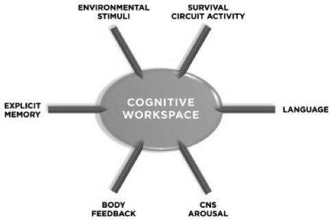
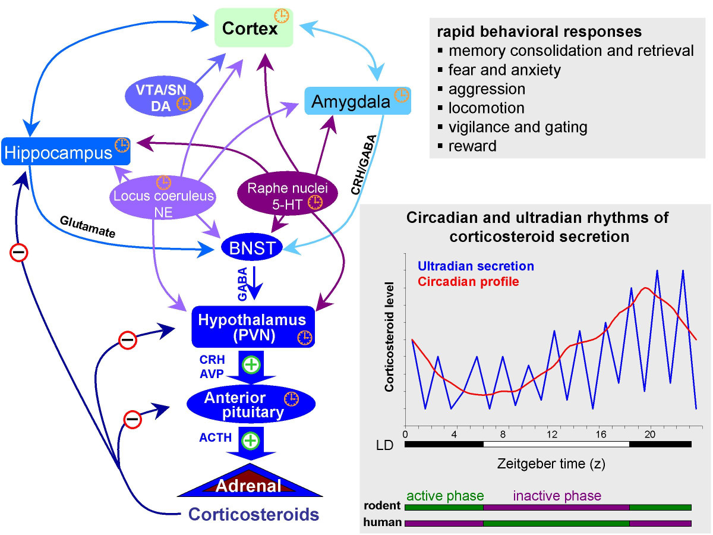
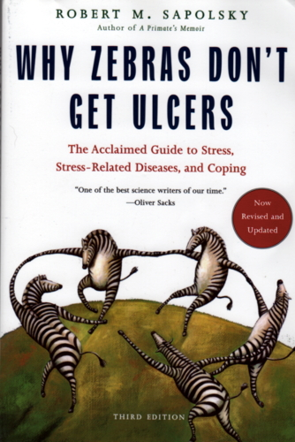

```{r, echo=FALSE}
knitr::opts_chunk$set(echo = FALSE, warning = FALSE, message = FALSE,
                      fig.align = "center")
```

## Announcements

- Exam 3 next Thursday, March 31

## Today's Topics

- Fear & stress

# Fear and stress

## Inducing "fear-like" behavior in animals {.smaller}

<div class="centered">


<http://www.cns.nyu.edu/labs/ledouxlab/images/image_research/fear_conditioning.jpg>
</div>

## Rat vs. Human {.smaller}

<div class="centered">


Adapted from [[@davis1992role]](http://dx.doi.org/10.1016/0165-6147(92)90014-W)
</div>

## Amygdala circuits {.smaller}

<div class="centered">


[[@medina2002parallels]](http://dx.doi.org/10.1038/nrn728)
</div>

## Amygdala's inputs

- Convergent inputs
    + Thalamus ("direct" or "fast"")
    + Cerebral cortex ("indirect" or "slow")

## Amygdala's outputs

- Project to
    + CG (central gray matter) of tegmentum: behavior
    + LH (lateral hyp): ANS
    + PVN (paraventricular n. of hyp): hormones
- Fast-acting, involuntary responses
- Lesions of amygdala impair 'fear conditioning'

## Cerebral cortex role

- Response discrimination?
    + Cortex lesions cause generalized not cue-specific fear response 
- Fast, crude responses vs. slower, detailed ones
    + That’s a stick, not a snake!
    + Prefrontal cortex and response inhibition

## But, are we really studying learned 'fear'?

- Amygdala connected to other 'affective' nodes in neural network
- Emotion not just about subjective feelings

## Amygdala as processing hub {.smaller}

<div class="centered">


[[@pessoa_relationship_2008]](http://dx.doi.org/10.1038/nrn2317)
</div>

## Amygdala as key hub in circuit for survival {.smaller}


```{r, out.height="500px", fig.cap="[[@ledoux_rethinking_2012]](http://dx.doi.org/10.1016/j.neuron.2012.02.004)"}
knitr::include_graphics("img/ledoux-2012-f3.jpg")
```

## Emotion as global physiological/behavioral "state" {.smaller}

```{r, out.height="500px", fig.cap="[[@ledoux_rethinking_2012]](http://dx.doi.org/10.1016/j.neuron.2012.02.004)"}

```

## Stress {.smaller}

```{r, out.height="500px"}
knitr::include_graphics("https://thumbs-prod.si-cdn.com/2tgS7DS-nibt7QIVjjP6a81H8VE=/800x600/filters:no_upscale():focal(652x167:653x168)/https://public-media.si-cdn.com/filer/ee/bc/eebc7565-839b-4a17-82ab-5f20a1bbf73f/h8cd2ygg-1501513898.jpg")
```

## Stressors linked with biological imperatives

- Sustenance
    + Hunger, thirst
- Well-being/defense
    + Threat
    
## Stressors linked with biological imperatives

- Reproduction
    + Rejection
- Affiliation
    + Loneliness
     
## Stress and the brain {.smaller}

<div class="centered">


[[@mcewen_physiology_2007]](http://dx.doi.org/10.1152/physrev.00041.2006)
</div>

## Regulating internal states

- Homeostasis
    - Regulation of physiological variables (e.g., blood $O_2$) via negative feedback [[@Cannon1929-ij]](https://doi.org/10.1152/physrev.1929.9.3.399)
- Allostasis [@Sterling1988-rl]
    - Regulation is active process
    - Regulation is anticipatory, varies by circumstance
    - Target levels vary [[@Ramsay2014-la]](http://dx.doi.org/10.1037/a0035942)

## Brain under stress 

- **Acute** stress
    + Short duration
    + Fast action required
    + HPA (Cortisol), SAM (NE/Epi) axes
- Brain detects threat
- Mobilizes physiological, behavioral responses

## Brain under stress

- vs. **Chronic** stress
    + Long duration, persistent
    
## Glucocorticoids

- Adrenal cortex releases cortisol (hydrocortisone)
  - Increases blood glucose levels
  - Suppresses immune system
  - Reduces inflammation
  - Aids in metabolism
+ Receptors in brain and body
    
## Cortisol and the brain {.smaller}

```{r, out.height="500px", fig.cap="http://www.molecularbrain.com/content/figures/1756-6606-3-2-1-l.jpg"}

```

## Glucocorticoid cascade hypothesis

- Cort receptors in hippocampus, amygdala, hypothalamus
    - Hippocampus (hipp) regulates HPA axis via hypothalamus
- Prolonged cortisol exposure reduces hippocampus response
    - Reduces volume, connectivity in hippocampus
- Hipp critical for long-term memory formation
    - Chronic stress impairs long-term memory

## But, cortisol -> stress link not straightforward {.smaller}

```{r, out.width="750px", fig.cap="[[@faresjo_higher_2013]](http://dx.doi.org/10.1371/journal.pone.0073828)"}
knitr::include_graphics("img/faresjo-2013.jpg")
```

## Stress and coping across the animal kingdom

- Pain thresholds lower (sensitivity greater) when a mouse's cage mate is also in pain
- Rats will cooperate to release distressed cage mate, foregoing food rewards
- [[@sapolsky_psychiatric_2016]](http://doi.org/10.1038/nn.4397)

## Why Zebras Don't Get Ulcers

```{r, out.width="600px"}

```

## Your (zebra) stress ain't like mine

- Phasic (short-term) vs. chronic (long-term)
- Physical stress (hunger, thirst, injury, disease) vs. social stress

## Where in the brain is emotion processed? {.smaller}

```{r, out.width="700px", fig.cap="[[@Lindquist2012-jr]](http://dx.doi.org/10.1017/S0140525X11000446)"}
knitr::include_graphics("https://static.cambridge.org/binary/version/id/urn:cambridge.org:id:binary:20170929031912583-0602:S0140525X11000446:S0140525X11000446_fig6g.jpeg")
```

## Where in the brain is emotion processed? {.smaller}

```{r, out.width="700px", fig.cap="[[@Lindquist2012-jr]](http://dx.doi.org/10.1017/S0140525X11000446)"}
knitr::include_graphics("img/lindquist-etal-2012-fig-s2.png")
```

## 'Emotion' responses in 'cognitive' areas {.smaller}

```{r, out.width="700px", fig.cap="[[@Lindquist2012-jr]](http://dx.doi.org/10.1017/S0140525X11000446)"}
knitr::include_graphics("img/lindquist-etal-2012-fig-s3.png")
```

## Main points

- Biological approach to emotion
    + Behavior
    + Physiological states
    + Subjective feelings
    + Adaptive function
- Networks of brain systems, multiple NT systems
- Emotional and cognitive processing have strong similarities

<!-- Scrolling final reference page -->
<!-- http://stackoverflow.com/q/38260799 -->
<style>
slides > slide { overflow: scroll; }
slides > slide:not(.nobackground):before {
  background: none;
  }
slides > slide:not(.nobackground):after {
  content: '';
  background: none;
  }
}
</style>

## References {.smaller}


