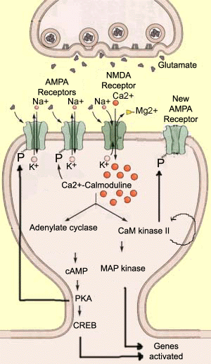

## Prelude

<iframe width="560" height="315" src="https://www.youtube.com/embed/5mlllRdIfqw" frameborder="0" allow="autoplay; encrypted-media" allowfullscreen></iframe>

<!-- 'Memory' from Cats -->

---

<iframe width="560" height="315" src="https://www.youtube.com/embed/hpTCZ-hO6iI" frameborder="0" allow="autoplay; encrypted-media" allowfullscreen></iframe>

<!-- Marilu Henner - I remember my whole life! -->

## Announcements

- Quiz 4 this Thursday
- No class this Thursday

## Today's topics

- Warm-up
- Biological basis of learning & memory

# Warm-up

## Why does Gilmore say the retina is anatomically 'inside-out'?

- The dorsal stream and the ventral stream project to different cortical targets
- Information from the left visual field projects to the right hemisphere
- Photoreceptors lie at the back of the eye, away from the path of light
- Long wavelength 'red-ish' lights can only be seen outside

## Why does Gilmore say the retina is anatomically 'inside-out'?

- ~~The dorsal stream and the ventral stream project to different cortical targets~~
- ~~Information from the left visual field projects to the right hemisphere~~
- <span class="blue">Photoreceptors lie at the back of the eye, away from the path of light</span>
- ~~Long wavelength 'red-ish' lights can only be seen outside~~

## Visual information from the retina projects to the ______ which controls circadian rhythms.

- Lateral geniculate nucleus (LGN) of the thalamus
- Dorso-medial nucleus of the thalamus
- Superior colliculus/optic tectum
- Suprachiasmatic nucleus of the hypothalamus

## Visual information from the retina projects to the ______ which controls circadian rhythms.

- ~~Lateral geniculate nucleus (LGN) of the thalamus~~
- ~~Dorso-medial nucleus of the thalamus~~
- ~~Superior colliculus/optic tectum~~
- <span class="blue">Suprachiasmatic nucleus of the hypothalamus</span>

## Hubel and Wiesel did not find many cells in V1 that had center-surround receptive fields because

- Many cells in V1 have elongated, rectangular-shaped, receptive fields
- V1 cells don't have receptive fields
- V1 doesn't respond to visual information that strongly
- The visual cortex doesn't respond strongly under anesthesia

## Hubel and Wiesel did not find many cells in V1 that had center-surround receptive fields because

- <span class="blue">Many cells in V1 have elongated, rectangular-shaped, receptive fields</span>
- ~~V1 cells don't have receptive fields~~
- ~~V1 doesn't respond to visual information that strongly~~
- ~~The visual cortex doesn't respond strongly under anesthesia~~

# Biological basis of learning and memory

## Memory capacity of the human brain?

## Memory capacity of the human brain?

- 1e12 neurons
- 1e3 synapses/neuron
- 1e15 synapses or 1.25e14 bytes
- 1e9 gigabyte, 1e12 terabyte, 1e15 petabyte

<http://www.scientificamerican.com/article.cfm?id=what-is-the-memory-capacity>

## Meister (2019)

>"*Entirety of a human's lived experience could fit on a flash drive.*"

<div class="centered">

</div>


---

<div class="centered">

</div>

<!-- Computer memory -->

## Computer memory

- Random Access Memory (RAM), short-duration storage
- Hard-disk/flash drive storage, long-term duration
- Addressable (location '010101')

## Computer memory

- {text, sounds, images, video, data} all in binary [0,1] format
    - `00110000` == 48 (the number)
    - `00110000` == '0' (the character zero)
- Write once, read many times

## Computers vs. brains

- Computers have separate memory stores
    - brains store info everywhere
- Computers have addressable memory
    - brain memory??
- Computer memory can be non-volatile
    - brain memories fade
- Computer memory is veridical
    - brain memories are 'reconstructions'

## What is learning?

## What is learning?

- *A*: Acquisition of new or change in existing knowledge, skills, responses...

## Types of learning

- **Non-associative**
    - Change in response to repeated encounters with same stimulus/event
    - Habituation -> weaker response
    - Sensitization -> stronger response
    
---

```{r, echo=FALSE, fig.align='center', out.height='500px'}
knitr::include_graphics("https://www.researchgate.net/profile/James_Herman3/publication/256074938/figure/fig3/AS:216468764532738@1428621583098/Stress-habituation-and-facilitation-Repeated-exposure-to-the-same-stressor-results-in.png")
```

---

- **Associative**
    - "Associates" two events/items with one another
    - Classical & operant/instrumental conditioning
    - Sequence, observational, episodic, semantic
    
## Can single-celled organisms *learn*?

> "*The question of whether single cells can learn led to much debate in the early 20th
century. The view prevailed that they were capable of non-associative learning but not of
associative learning, such as Pavlovian conditioning. Experiments indicating the contrary were
considered either non-reproducible or subject to more acceptable interpretations.*"

> [[@Gershman2021-zf]](https://doi.org/10.7554/eLife.61907)

## Can single-celled organisms *learn*?

> "*We exhume the experiments of Beatrice Gelber on Pavlovian conditioning in the ciliate Paramecium aurelia, and
suggest that criticisms of her findings can now be reinterpreted...Her work, and more recent studies, suggest that such learning may be evolutionarily more widespread and fundamental to life than previously thought and we discuss the implications for different aspects of biology*"

> [[@Gershman2021-zf]](https://doi.org/10.7554/eLife.61907)

## What is memory?

## What is memory?

- A: Information encoding, storage, retrieval

## Dimensions of memory

- Short vs. long-term
    - Working memory ~ short-term maintenance for guiding action
- Explicit (declarative: semantic vs. episodic) vs. implicit (procedural)
- Retrospective (from the past) vs. prospective (to be remembered)
- Recognition (familiar or novel) vs. recall

## Biological bases...

- Changes in patterns of neural activity
- Changes in connectivity
    + New synapses
    + Altered synapses (strengthened or weakened)
    
## Memory systems in the brain

<div class="centered">


[[@squire_memory_2004]](http://dx.doi.org/10.1016/j.nlm.2004.06.005)
</div>

## Donald Hebb's Insight

*When an axon of cell A is near enough to excite cell B and repeatedly or persistently takes part in firing it, some growth process or metabolic change takes place in one or both cells such that A’s efficacy, as on of the cells firing B, is increased.* (Hebb, 1949, p. 62)

*Neurons that fire together wire together.* (Lowell & Singer, 1992, p. 211).

## How to implement 'Hebbian' learning?

- Hebbian learning is associative
- Neuron A active + Neuron B active => associates/links co-activity

## [Long-term potentiation (LTP)](https://en.wikipedia.org/wiki/Long-term_potentiation)

- Increase (potentiation) in synaptic strength based on recent co-activity
- Change at synapse == physical basis of Hebbian learning

---

<div class="centered">


<https://upload.wikimedia.org/wikipedia/commons/thumb/b/b9/LTP_exemplar.jpg/800px-LTP_exemplar.jpg>
</div>

##  'Hebbian' learning via NMDA receptor

- *N-methyl-D-aspartate* receptor (NMDA-R)
- 'Coincidence' detector
    + Sending cell has released NT
    + Receiving cell is/has been recently active
    
## NMDA receptor figure {.smaller}

<div class="centered">


<https://upload.wikimedia.org/wikipedia/commons/thumb/0/00/Activated_NMDAR.svg/220px-Activated_NMDAR.svg.png>
</div>

---

```{r, fig.cap='https://i2.wp.com/www.gatewaypsychiatric.com/wp-content/uploads/2015/02/NMDA-Receptor-and-Depression.jpg?ssl=1', fig.align='center', echo=FALSE}
knitr::include_graphics("https://i2.wp.com/www.gatewaypsychiatric.com/wp-content/uploads/2015/02/NMDA-Receptor-and-Depression.jpg?ssl=1")
```

##  Example mechanism for 'Hebbian' learning

- Chemically-gated AND
    + Ligand- (glutamate/aspartate + glycine) gated
    + Sending cell active
- Voltage-gated
    + $Zn^{++}$ or $Mg^{++}$ ion 'plug' removed under depolarization
    + $Na^+$ & $Ca^{++}$ influx; $K^+$ outflux
    + Receiving cell responds

## NMDA receptors (NMDA-R) contribute to associative learning

- Associate (link)
    + Concept A -> Concept B
    + Neuron A -> Neuron B
    
## I say Donald

## You say...

## Donald

- Trump
- Duck
- Draper

## How does LTP (& LTD) work?

- Synapses can also be weakened via long-term depression (LTD)
- NMDA receptor one molecular mechanism for implementing LTP, LTD & spike-timing-dependent plasticity
- Ca++ entry triggers biochemical cascade

---

- Existing (AMPA) glutamate receptors made to stay open longer
- New AMPA glutamate receptors synthesized, inserted into postsynaptic membrane
- Change in quantity of glutamate released presynaptically

<!-- ## LTP signaling {.smaller} -->

<!-- <div class="centered"> -->
<!--  -->

<!-- <http://thebrain.mcgill.ca/flash/a/a_07/a_07_m/a_07_m_tra/a_07_m_tra.html> -->
<!-- </div> -->

## NMDA clinical significance

- *Memantine* (Alzheimer's Disease treatment) *blocks* NMDA-R
    - Controls over-activation and $Ca^{++}$ excitotoxicity?
- Implicated in effects of *phencylidine* (PCP)
    - PCP can induce psychotic symptoms
    - Link to glutamate hypothesis of schizophrenia?

## NMDA clinical significance

- *Ketamine* is an NMDA-R antagonist
    - anesthesia, sedation pain relief
    - short-term relief for depression
- Linked to analgesic (pain-relieving) effects of nitrous oxide ($N_{2}O$) or 'laughing' gas
- Ethanol inhibits [(Ron et al., 2011)](https://www.ncbi.nlm.nih.gov/pubmed/21204417)

## Learning "causal chains"

- lightning THEN thunder
- unusual food THEN indigestion

## Spike-timing-dependent plasticity {.smaller}

<div class="centered">


[[@caporale2008spike]](http://dx.doi.org/10.1146/annurev.neuro.31.060407.125639)
</div>
   
## Spike-timing-dependent plasticity {.smaller}

<div class="centered">


[[@caporale2008spike]](http://dx.doi.org/10.1146/annurev.neuro.31.060407.125639)
</div>

## Spike-timing-dependent plasticity

- A before B: strengthen A->B
- A after B: weaken A->B
- [*Neural Plasticity*](https://en.wikipedia.org/wiki/Neuroplasticity)
    + Lasting changes in neural firing, connectivity

## Memory systems in the brain

<div class="centered">


[[@squire_memory_2004]](http://dx.doi.org/10.1016/j.nlm.2004.06.005)
</div>

## Summary

- Learning and memory involve changes in neural firing, circuitry
- Hebbian learning a type of associative learning
- NMDA receptor as coincidence detector
    + Molecular basis of one form of long-term potentiation (LTP)
- Different types of information stored in different brain systems

## Next time...

- More on learning and memory

## References {.smaller}
