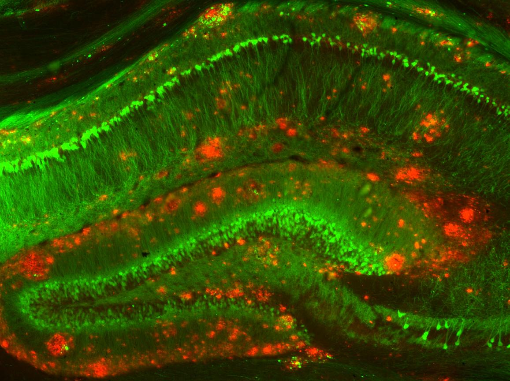

```{r setup, include=FALSE}
knitr::opts_chunk$set(echo = FALSE, warning = FALSE, 
                      message = FALSE,
                      fig.align = "center",
                      out.width = "600px")
```

## Announcements

- Exam 4, Tuesday, May 3, <span class="red">12:00 PM (noon) - 10:00 PM</red>

## Today's topics

- Wrap-up on [learning and memory](https://psu-psychology.github.io/psych-260-2022-spring/lectures/260-2022-04-19-memory.html#45)
- Disorders of memory

# Review from last time

## Memory systems in the brain

<div class="centered">


[[@squire_memory_2004]](http://dx.doi.org/10.1016/j.nlm.2004.06.005)
</div>

## Review from last time

- Learning and memory involve changes in neural firing, circuitry
- Hebbian learning a type of associative learning
- NMDA receptor as coincidence detector
    + Molecular basis of one form of long-term potentiation (LTP)
- Different types of information stored in different brain systems
- Wrap-up on [learning and memory](https://psu-psychology.github.io/psych-260-2022-spring/lectures/260-2022-04-19-memory.html#45)

# Disorders of memory

## [Patient HM](http://www.pbs.org/wgbh/nova/body/corkin-hm-memory.html) (Henry G. Molaison)

- Intractable/untreatable epilepsy
- Bilateral resection of medial temporal lobe (1953)
- Epilepsy now treatable
- But, memory impaired
- Lived until 2008

## HM's surgery

```{r, fig.cap="https://www.pbs.org/wgbh/nova/media/images/corkin-hm-memory-08.width-800.jpg", echo=FALSE, fig.align='center'}
knitr::include_graphics("https://www.pbs.org/wgbh/nova/media/images/corkin-hm-memory-08.width-800.jpg")
# HM's brain
```

## Brenda Milner tells the story

<iframe width="560" height="315" src="https://www.youtube.com/embed/aw6JmZuLhfA" title="YouTube video player" frameborder="0" allow="accelerometer; autoplay; clipboard-write; encrypted-media; gyroscope; picture-in-picture" allowfullscreen></iframe>
<!-- Brenda Milner on HM -->

## Amnesia

- Acquired loss of memory
- ≠ normal forgetting
- Note: computers don't forget

## HM's amnesia

- Retrograde amnesia
    + Can’t remember 10 yrs before operation
    + Distant past better than more recent
- Severe, global anterograde amnesia
    + Impaired learning of new facts, events, people
- But, skills (mirror learning) intact
    
## Types of amnesia

- Retrograde ('backwards' in time)
    + Damage to information acquired pre-injury
    + Temporally graded
- Anterograde ('forward' in time) 
    + Damage to information acquired/experienced post-injury

## What it's like

*Every day is alone in itself, whatever enjoyment I’ve had, and whatever sorrow I’ve had…Right now, I’m wondering, have I done or said anything amiss?  You see at this moment, everything looks clear to me, but what happened just before?  That’s what worries me.  It’s like waking from a dream.  I just don’t remember.*

## What it's like

<iframe width="560" height="315" src="https://www.youtube.com/embed/Rq9eM4ZXRgs" frameborder="0" allowfullscreen></iframe>

<!-- Trailer for the film, 'Memento' -->
    
## Other causes of amnesia

- Disease 
    + Alzheimer’s, herpes virus
- [Korsakoff’s syndrome](https://en.wikipedia.org/wiki/Korsakoff%27s_syndrome)
    + Result of severe alcoholism
    + Impairs medial thalamus & mammillary bodies

## Patient NA

- Fencing accident
- Damage to medial thalamus
- Anterograde + graded retrograde amnesia
- Are thalamus & medial temporal region connected?

## Patient NA

<iframe width="420" height="315" src="https://www.youtube.com/embed/1GfFopZSyj8" frameborder="0" allowfullscreen></iframe>

## Spared skills in amnesia

- Skill-learning
- Mirror-reading, writing
- Short-term memory
- “Cognitive” skills
- Priming

## What does amnesia tell us?

- Long-term memory for facts, events, people 
- ≠ Short-term memory
- ≠ Long-term memory for “skills”
- Separate memory systems in the brain?

## Alzheimer's Disease (AD)

- Chronic, neurodegenerative disease affecting ~5 M Americans
- Cognitive dysfunction (memory loss, language difficulties, planning, coordination)
- Psychiatric symptoms and behavioral disturbances
- Difficulties with daily living
- [[@burns_alzheimers_2009]](http://doi.org/10.1136/bmj.b158)

## Progression

```{r, fig.cap="[[@burns_alzheimers_2009]](http://doi.org/10.1136/bmj.b158)"}
knitr::include_graphics("img/bmj-158-F1.large.jpg")
```

---

- Post-mortem exams show $\beta$ amyloid plaques and neurofibrillary tangles in hippocampus + other brain areas

```{r, out.height="350px"}

```

## AD Treatments
    
- Acetylcholinesterase (AChE) inhibitors (e.g. Aricept)
    - ACh a neuromodulator in the brain
- NMDA-R partial antagonists (e.g., Memantine)
- Drugs that address amyloid $\beta$ don't work especially well
- AD the result of [disordered immune response](http://doi.org/10.1016/j.arr.2017.08.005)?

## Hippocampus

```{r, fig.cap="https://upload.wikimedia.org/wikipedia/commons/5/5b/Hippocampus_and_seahorse_cropped.JPG"}
knitr::include_graphics("img/hippocampus-seahorse.jpg")
```

## Hippocampus & medial temporal lobe areas

- Dense in NMDA receptors
- Formation, storage, consolidation of long-term episodic or declarative memories
- Stores info for later transfer to cortex

## Hippocampus in non-human animals

- Similar architecture to humans
    - More known about mechanisms for *spatial* than *non-spatial* memory
+ [Place cells](https://en.wikipedia.org/wiki/Place_cell)
+ [Grid cells](http://www.scholarpedia.org/article/Grid_cells)
+ [Head-direction cells](http://www.scholarpedia.org/article/Head_direction_cells)

---

```{r, fig.cap="[[@Dickerson2010-qh]](http://dx.doi.org/10.1038/npp.2009.126)", out.width="600px"}
knitr::include_graphics("https://media.springernature.com/full/springer-static/image/art%3A10.1038%2Fnpp.2009.126/MediaObjects/41386_2010_Article_BFnpp2009126_Fig2_HTML.jpg?as=webp")
```

## Cortical areas activated or deactivated during memory encoding

```{r, fig.cap="[[@Dickerson2010-qh]](http://dx.doi.org/10.1038/npp.2009.126)", out.width="600px"}
knitr::include_graphics("https://media.springernature.com/full/springer-static/image/art%3A10.1038%2Fnpp.2009.126/MediaObjects/41386_2010_Article_BFnpp2009126_Fig5_HTML.jpg?as=webp")
```

## Cortical areas deactivated in non-memory cognitive tasks but activated during memory retrieval

```{r, fig.cap="[[@Dickerson2010-qh]](http://dx.doi.org/10.1038/npp.2009.126)", out.width="600px"}
knitr::include_graphics("https://media.springernature.com/full/springer-static/image/art%3A10.1038%2Fnpp.2009.126/MediaObjects/41386_2010_Article_BFnpp2009126_Fig6_HTML.jpg?as=webp")
```

## Memory systems in the brain

<div class="centered">


[[@squire_memory_2004]](http://dx.doi.org/10.1016/j.nlm.2004.06.005)
</div>

## References {.smaller}

<!-- Scrolling final reference page -->
<!-- http://stackoverflow.com/q/38260799 -->
<style>
slides > slide { overflow: scroll; }
slides > slide:not(.nobackground):before {
  background: none;
  }
slides > slide:not(.nobackground):after {
  content: '';
  background: none;
  }
}
</style>