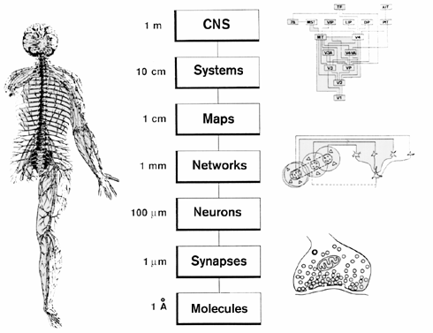
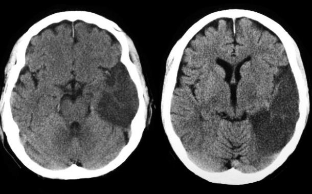

```{r, echo=FALSE}
knitr::opts_chunk$set(
  fig.align = "center",
  echo=FALSE
)
```

## Prelude (9:01)

<iframe width="420" height="315" src="https://www.youtube.com/embed/0fKBhvDjuy0" frameborder="0" allowfullscreen></iframe>

<div class="notes">
Classic "Powers of Ten" movie by Charles and Ray Eames (10 min).
</div>

## Today's topics

- History of neuroscience
- Levels of analysis
- Methods to the madness

<!-- ## History of neuroscience -->

<!-- - History of the study of brain and behavior -->
<!-- - What did humans know about brain and behavior *before* the emergence of the scientific method? -->

# Warm-up

## Neuroscience is harder than physics because...

- A. The brain has more parts than any other physical entity we know about.
- B. Physicists have largely ignored biology.
- C. Nervous systems are influenced by multiple factors we can't (yet) measure effectively.
- D. Physicists only study "toy" problems.

## Neuroscience is harder than physics because...

- A. ~~The brain has more parts than any other physical entity we know about.~~
- B. ~~Physicists have largely ignored biology.~~
- C. Nervous systems are influenced by multiple factors we can't (yet) measure effectively.
- D. ~~Physicists only study "toy" problems.~~

## Systems have all of the following components EXCEPT:

- A. Boundaries
- B. Components
- C. Interactions among components
- D. Inputs and outputs
- E. Readily predictable behavior

## Systems have all of the following components EXCEPT:

- A. Boundaries
- B. Components
- C. Interactions among components
- D. Inputs and outputs
- E. <span class="red">Readily predictable behavior</span>

# History of neuroscience

## Why study history?

- What can *observation* tell us about brain and behavior?
- Vital role of *tools/methods/techniques* in discovery
- *"If I have seen further, it is by standing on the shoulders of giants."* -- Isaac Newton, 1676

----

<div class="centered">
<a href="https://www.youtube.com/watch?v=S0HKupSZq8k">
<iframe width="560" height="315" src="https://www.youtube.com/embed/S0HKupSZq8k" frameborder="0" allowfullscreen></iframe>
</a>
</div>

<!-- # Pre/Early history -->

<!-- ## [*Trephining* (trepanning)](https://en.wikipedia.org/wiki/Trepanning) -->

<!-- <div class="centered"> -->
<!-- <a href="http://www.news.ucsb.edu/sites/www.news.ucsb.edu/files/slideshow_images/2013/Kurin-Trepanation1.jpg"> -->
<!-- </a> -->
<!-- </div> -->

<!-- ## Trephining -->

<!-- <div class="centered"> -->
<!-- <a href="http://i2.cdn.turner.com/cnnnext/dam/assets/150414123319-ancient-trepanning-super-169.jpg"> -->
<!--  -->
<!-- </a> -->
<!-- </div> -->

<!-- ## [Beer-making (~5,000 BCE)](https://en.wikipedia.org/wiki/History_of_beer) -->

<!-- <div class="centered"> -->
<!-- <a href="http://www.beerintheworld.com/images/history/history001.gif"> -->
<!-- </a> -->
<!-- </div> -->

<!-- ## Egyptians (1,500-3,000 BCE) first written record of the term “brain” -->

<!-- <div class="centered"> -->
<!-- <a href="http://faculty.washington.edu/chudler/gif/papybr.gif"> -->
<!--  -->
<!-- </a> -->
<!-- </div> -->

<!-- # Greek and Roman era -->

<!-- ## Greeks -->

<!-- - [*Hippocrates*](https://en.wikipedia.org/wiki/Hippocrates) -->
<!-- - [*Aristotle* (335 BCE)](https://en.wikipedia.org/wiki/Aristotle) -->

<!-- ---- -->

<!-- <div class="centered"> -->
<!-- <a href="http://classicalwisdom.com/wp-content/uploads/2013/02/aristotle-face-1.jpg"> -->
<!-- </a> -->
<!-- </div> -->

<!-- ## Aristotle on the mind and brain -->

<!-- - mind and body not distinct. -->
<!-- - brain “cools” the body, *heart* is the mental organ. -->

<!-- ## [*Galen* (~177 CE)](https://en.wikipedia.org/wiki/Galen) -->

<!-- <div class="centered" -->
<!-- <a href="http://images.fineartamerica.com/images-medium-large/5-galen-greek-physician-and-philosopher-science-source.jpg"> -->
<!--  -->
<!-- </a> -->
<!-- </div> -->

<!-- ## Galen and his ideas -->

<!-- - Physician in Roman Empire, of Greek descent -->
<!-- - Anatomical reports based on dissection of monkeys, pigs -->
<!-- - Influenced by Hippocrates notion of human temperaments (~personalities) linked to "humors": blood, black bile, yellow bile, phlegm -->
<!-- - Speculated that fluid filling the brain cavities called *ventricles*, circulates through nerves, body -->
<!-- - Gladiators' head injuries impaired thinking, movement -->

<!-- ## Ventricles -->

<!-- <div class="centered"> -->
<!-- <a href="http://www.cerebromente.org.br/n06/historia/am1.gif"> -->
<!-- </a> -->
<!-- </div> -->

## What did early humans know about the mind and brain?

- Mental functions controlled by organs in the head, i.e., the brain
- Mental functions can be influenced by substances we consume
- Head injury can impair behavior and thinking
- Something flows from brain to body via nerves

## Why didn't they know more?

## Why didn't they know more?

- A. Limited technology.
- B. Limited cultural support for systematic observation & description. = SCIENCE
- C. Lack of ability to use knowledge even if it were acquired.

<!-- ## The "dark" ages (in Europe, not elsewhere) -->

<!-- - [Ibn al-Haytham's](https://en.wikipedia.org/wiki/Alhazen) *Optics*, ~1000 CE -->
<!-- - [Mansur's *Anatomy*](https://exhibitions.lib.cam.ac.uk/vesalius/artifacts/mansurs-anatomy/) ~1400 CE -->

<!-- # Renaissance and the Enlightenment: New technologies, new ideas -->

<!-- ## *Vesalius* (1543) -->

<!-- - 1st detailed drawings of brain and body anatomy -->

<!-- ## Vesalius' drawings -->

<!-- <div class="centered"> -->
<!-- <a href="https://upload.wikimedia.org/wikipedia/commons/a/a7/Vesalius_609c.png"> -->
<!--  -->
<!-- </a> -->
<!-- </div> -->

<!-- ## *Leonardo da Vinci* (1504) -->

<!-- - Wax casts of ventricles -->
<!--     - fluid filled inner regions of brain -->
<!-- - Ventricles not spherical! -->

<!-- ## da Vinci's sketches -->

<!-- <div class="centered"> -->
<!-- <a href="http://www.unige.ch/cyberdocuments/theses2003/RivaraC-B/images/fig.1.jpg"> -->
<!--  -->
<!-- </a> -->
<!-- </div> -->

## The body as machine (René Descartes -- mid 1600’s)

<div class="centered">
<a href="img/automata_duck.jpg">

</a>

## Descartes' 'reflexes'

- Reflexes “reflect” events in the world
- Not the same as voluntary functions

## Descartes' reflexes

<div class="centered">
<a href="https://upload.wikimedia.org/wikipedia/commons/8/8a/Descartes-reflex.JPG"> 
</a>
</div>

## Descartes' 'dualism'

- Reflexes and animal “minds” are physical, machine-like
- Human mind is not
    - “Dual” influences on behavior
    - Physical + spiritual
- Soul controls body via *pineal gland*
    - Causes muscles to “inflate”

<!-- ## Pineal Gland -->

<!-- <div class="centered"> -->
<!-- <a href="http://www.nature.com/nrn/journal/v5/n9/images/nrn1498-f1.jpg"> -->
<!--  -->
<!-- </a> -->

## Pineal gland

<div class="centered">
<a href="http://images.fineartamerica.com/images-medium-large-5/descartes-pineal-gland-granger.jpg">

</a>
</div>

## Do you agree with Descartes?

- A. **Yes**, human minds are fundamentally different from animal minds. The human mind is influenced by both physical and extraphysical processes.
- B. **No**, human minds are similar to animal minds. The human mind arises solely from physical processes.

## How would you test Descartes idea about the role of the pineal gland?

<!-- ## Other milestones -->

<!-- - Invention of [light microscope](http://www.history-of-the-microscope.org/invention-of-glass-lenses-and-the-history-of-the-light-microscope.php) (1609 CE), [electron microscope](https://en.wikipedia.org/wiki/Electron_microscope) (1926) -->
<!-- - Cell stains -- [Camillo Golgi](https://en.wikipedia.org/wiki/Camillo_Golgi), [Santiago Ramon y Cajal](https://en.wikipedia.org/wiki/Santiago_Ram%C3%B3n_y_Cajal) -- late 1800s -->
<!-- - Recording of electrical activity of nerves, [Luigi Galvani](https://en.wikipedia.org/wiki/Luigi_Galvani) -->
<!-- - [Magnetic resonance imaging (MRI)](https://en.wikipedia.org/wiki/Magnetic_resonance_imaging) -->

## The lessons from history

- Neuroscience shaped by new methods, tools
- Neuroscience shaped by [great debates](http://www.columbia.edu/cu/psychology/courses/1010/mangels/neugiro/history/history.html)
    - Mind == brain debate
    - Are functions local or distributed?
    - Do neurons connect like pipes or pass info like relay runners?
- Forms at multiple levels of analysis contribute to function

# Levels of analysis

## Spatial resolution

<div class="centered">

</div>

## Spatial and Temporal Resolution {.smaller}

```{r, out.width="600px", fig.cap="[[@sejnowski2014putting]](https://doi.org/10.1038/nn.3839)"}
knitr::include_graphics("https://media.springernature.com/lw685/springer-static/image/art%3A10.1038%2Fnn.3839/MediaObjects/41593_2014_Article_BFnn3839_Fig1_HTML.jpg?as=webp")
```

<!-- ## Spatial Resolution in Detail -->

<!-- - Within an individual -->
<!--     + molecular -->
<!--         * genetic -->
<!--         * receptor -->
<!--     + chemical -->
<!--         * neurotransmitter/hormonal -->
<!--     + cellular -->
<!--         * neuronal firing -->

<!-- ## Spatial Resolution in Detail -->

<!-- - Internal to individuals -->
<!--     + network -->
<!--         * lateral inhibition -->
<!--     + area -->
<!--         * V1 varies by ~2x -->
<!--     + region -->
<!--         * Wiring/connectivity differences -->
<!--     + system -->

<!-- ## Spatial Resolution in Detail -->

<!-- - External to individuals -->
<!--     + Social -->
<!--         * Friends, family, teachers, others -->
<!--     + Non-social -->
<!--         * Neighborhood, school, state/region, country -->
<!--         * Physical environment -->

<!-- ## Temporal Resolution in Detail -->

<!-- - Within one lifetime -->
<!--     + Microseconds -->
<!--         * detection position from acoustic stimulation -->
<!--     + Milliseconds -->
<!--         * action potential -->
<!--     + Seconds -->
<!--         * changes in EEG power -->
<!--         * short-term memory -->

<!-- ## Temporal Resolution in Detail -->

<!-- - Within one lifetime -->
<!--     + Minutes -->
<!--         * synaptic plasticity -->
<!--     + Hours -->
<!--         * memory consolidation -->
<!--         * Hormone (melatonin, cortisol) levels -->
<!--     + Days -->

<!-- ## Temporal Resolution in Detail -->

<!-- - Within one lifetime -->
<!--     + Weeks -->
<!--     + Months -->
<!--     + Years -->
<!--         * education & training -->
<!--         * disease processes -->
<!--         * cultural change -->

<!-- ## Temporal Resolution in Detail -->

<!-- - Across lifetimes -->
<!--     + Centuries -->
<!--         * cultural changes -->
<!--     + Millenia -->
<!--         * Natural & sexual selection -->

## Your turn

- What's a micro (spatially small) influence on/aspect of behavior?
- What's a macro (spatially large)...
- What's a micro (temporally short)...
- What's a macro (temporally long)...
    
## Why does this matter?

- Different methods, different levels of analysis
- Challenge of linking phenomena across levels
    + How does the micro affect macro or vice versa?
- Challenge of interpretation

# Neuroscience methods

## Methods to the madness

- Tools in the neuroscientist’s toolkit
- What they tell us, and what they don’t

## Evaluating methods 

- What question does method X answer?
- What are we measuring?
    + Structure
    + Activity
- Strengths & Weaknesses
    + Cost (time/$)
    + Invasiveness
    + Spatial/temporal resolution

## Spatial and Temporal Resolution

<div class="centered">
<a href="https://media.springernature.com/lw685/springer-static/image/art%3A10.1038%2Fnn.3839/MediaObjects/41593_2014_Article_BFnn3839_Fig1_HTML.jpg?as=webp">

</a>

[Sejnowski 2014](http://doi.org/10.1038/nn.3839)
</div>

## Types of methods

- Structural
    + Mapping the circuitry
    + Anatomy & connectivity
- Functional (next time)
    + What does it do?
    + Physiology/Activity

## Mapping structures

- Cell/axon stains
    + *Golgi stain* -- whole cells
        - [Camillo Golgi](https://en.wikipedia.org/wiki/Camillo_Golgi)
    + *Nissl stain* -- cell bodies only
        - [Franz Nissl](https://en.wikipedia.org/wiki/Franz_Nissl)
    + Cellular distribution, concentration, microanatomy

## [Golgi stain](http://2e.mindsmachine.com/glossary.html#G)

<div class="centered">
<a href="http://connectomethebook.com/wp-content/uploads/2011/11/Brainforest17_1119.jpg">

</a>
</div>

---

- Complete nerve cells, but only 5-10\% of total

## [Nissl stain](http://2e.mindsmachine.com/glossary.html#N)

<div class="centered">
<a href="https://www.neuroscienceassociates.com/wp-content/uploads/thionin-rhesus.jpg">

</a>
</div>

---

- Only cell bodies
- Density of staining ~ cell density/number

## Retrograde vs. anterograde [histochemical tracers](https://en.wikipedia.org/wiki/Histochemical_tracer)

- Neuron information flow *polarized*--flows in one direction
    - ≠ electronic wires, but like pipes
- *Retrograde* (from *axon terminal* to *cell body*); *anterograde* (from cell body to axon terminal)
- What connects where
    - inputs to region X
    - outputs from region X

## Retrograde vs. anterograde tracers

<div class="centered">
<a href="http://openi.nlm.nih.gov/imgs/512/348/3176268/3176268_1471-2105-12-351-2.png">

</a>
</div>

## [Brainbow](http://cbs.fas.harvard.edu/science/connectome-project/brainbow)

<div class="centered">


[Lichtman, 2008](http://doi.org/10.1038/nrn2391)
</div>

## Brainbow

<div class="centered">


[Lichtman, 2008](http://doi.org/10.1038/nrn2391)
</div>

---

<iframe width="560" height="315" src="https://www.youtube.com/embed/nvXuq9jRWKE" frameborder="0" allow="accelerometer; autoplay; encrypted-media; gyroscope; picture-in-picture" allowfullscreen></iframe>

> *"If understanding everything we need to know about the brain is a mile, how far have we walked?"*
> -- J. Lichtman

## [Clarity](http://clarityresourcecenter.com/CLARITY.html)

<iframe width="560" height="315" src="https://www.youtube.com/embed/c-NMfp13Uug" frameborder="0" allowfullscreen></iframe>

## Evaluating cellular tracing techniques

- Invasive (in humans post-mortem only)
- High spatial resolution, but poor temporal resolution
    - Why?

## Mapping structures

- Computed axial tomography (CAT), computed tomography [CT](https://en.wikipedia.org/wiki/CT_scan)
- X-ray based

## Tomography

<div class="centered">
<a href="http://img.tfd.com/mk/T/X2604-T-22.png">

</a>
</div>

## Tomography

<div class="centered">


<https://cdn.hswstatic.com/gif/cat-scan-pineapple.jpg>
</div>

## CT scan of stroke

<div class="centered">
<a href="http://1.bp.blogspot.com/-I5AIwDp1jJM/UF9gqPEw4vI/AAAAAAAB77M/VfLRw2JDEiY/s1600/mca+inferior+division+infarct+ct+brain.JPG">

</a>
</div>

## [Magnetic Resonance Imaging (MRI)](https://en.wikipedia.org/wiki/Magnetic_resonance_imaging)

- Magnetic resonance
- Some common isotopes (e.g., H) & complex molecules have a magnetic dipole
- Axes align with strong magnetic field
- When alignment perturbed by radio frequency (RF) pulse, speed of realignment varies by tissue
- Realignment emits RF signals
- [How MRI works](https://science.howstuffworks.com/mri.htm)

## MRI

<div class="centered">


<https://cdn.hswstatic.com/gif/mri-steps.jpg>
</div>

## How MRI works

<iframe width="560" height="315" src="https://www.youtube.com/embed/1CGzk-nV06g" frameborder="0" allowfullscreen></iframe>

## <span class="blue">Structural</span> MRI

- Reveals tissue density/type differences
- [Gray matter](https://en.wikipedia.org/wiki/Grey_matter) (neurons & dendrites & axons & glia) vs. [white matter](https://en.wikipedia.org/wiki/White_matter) (mostly axons)
- MR Spectroscopy
    - Concentration of specific chemical substances (only some have MR signature)
- Region sizes/volumes

## Structural MRI of the brain

<div class="centered">
<a href="https://www.brainfacts.org/-/media/Brainfacts2/In-the-Lab/Tools-and-Techniques/Article-Images/MRI_blackandwhite.png?h=367&iar=0&w=650&hash=81CDDCBCA0C06F1B28DAFA372480461D2188847A">

</a>
</div>

## [Diffusion tensor imaging (DTI)](https://en.wikipedia.org/wiki/Diffusion_MRI#Diffusion_tensor_imaging)

<div class="centered">

</div>

## [Diffusion tensor imaging (DTI)](https://en.wikipedia.org/wiki/Diffusion_MRI#Diffusion_tensor_imaging)

- Type of structural MRI
- Measures patterns of movement/diffusion of $H_{2}O$
- Reveals integrity/density of axon fibers
- Measure of connectivity

## [Voxel-based morphometry (VBM)](https://en.wikipedia.org/wiki/Voxel-based_morphometry)

- [Voxels (volume-based elements)](https://en.wikipedia.org/wiki/Voxel)
- Morphometry, measure ("metry") form/morphology
- How does brain size or thickness vary by age, disease status, etc.?

----

<div class="centered">

<small>
<http://www.frontiersin.org/files/Articles/18691/fnhum-06-00184-HTML/image_m/fnhum-06-00184-g003.jpg>
</small>
</div>

## Main points

- Spatial vs. temporal resolution
- Structural methods (parts, sizes, connectivity)

## Next time...

- *Functional* neuroscience methods
