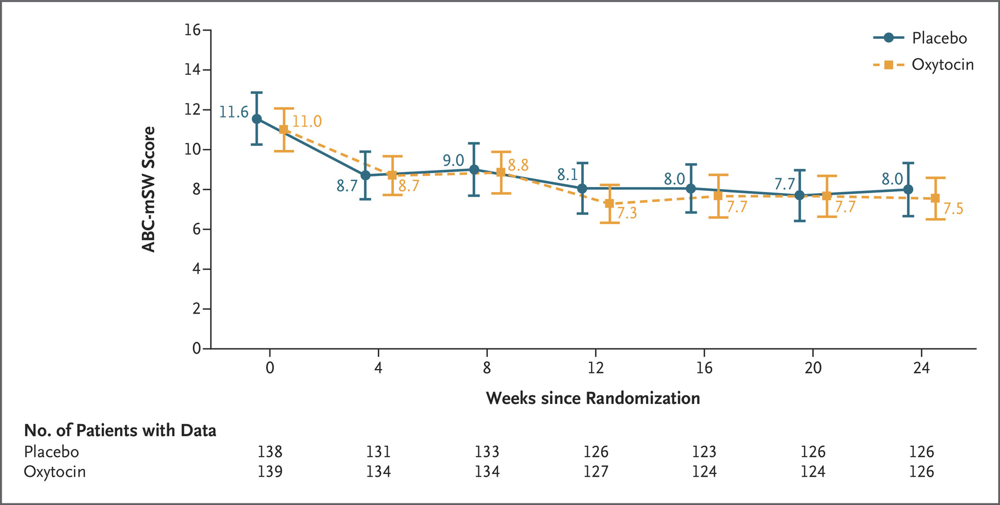

```{r, echo=FALSE}
knitr::opts_chunk$set(
  fig.align = "center",
  echo=FALSE
)
```

## Prelude

<div class="centered">
<a href="http://www.avanai.se/wp-content/uploads/2010/05/Breastfeeding-humor.jpg">

</a>
</div>

<!-- Udder-feeding in public -->

## Announcements

- Quiz 2 today (after class)
- Blog post 1 (of 3) due today by 5:00 PM
- Exam 2 *next* Tuesday, March 1 (no in-class meeting)

## Today's Topics

- Hormonal communication

# Warm-up

## Black widow spider venom causes paralysis by impeding the normal function of which neurotransmitter system?

- Glutamate (Glu)
- GABA (GABA)
- Dopamine (DA)
- Acetylcholine (ACh)

## Black widow spider venom causes paralysis by impeding the normal function of which neurotransmitter system?

- ~~Glutamate (Glu)~~
- ~~GABA (GABA)~~
- ~~Dopamine (DA)~~
- <span class="red">Acetylcholine (ACh)</span>

## With one exception, the monoamine neurotransmitters bind to what type of receptors?

- ionotropic
- voltage-gated
- nicotinic
- metabotropic

## With one exception, the monoamine neurotransmitters bind to what type of receptor?

- ionotropic
- voltage-gated
- nicotinic
- <span class="red">metabotropic</span>

## With one exception, the monoamine neurotransmitters bind to what type of receptor?

- ~~ionotropic~~
- ~~voltage-gated~~
- ~~nicotinic~~ ACh binds to nAChR; ACh not a monoamine 
- <span class="red">metabotropic</span>

## The *outward* flow of this ion across the neural membrane creates what kind of PSP?

- Cl-; IPSP
- K+; IPSP
- Glutamate; EPSP
- GABA; EPSP

## The *outward* flow of this ion across the neural membrane creates what kind of PSP?

- Cl-; IPSP
- <span class="red">K+; IPSP</span>
- Glutamate; EPSP
- GABA; EPSP

## The *outward* flow of this ion across the neural membrane creates what kind of PSP?

- ~~Cl-; IPSP~~ Outward Cl- -> inside less negative == EPSP
- <span class="red">K+; IPSP</span> Make inside less positive
- ~~Glutamate; EPSP~~ Glu not an ion; transported across
- ~~GABA; EPSP~~ GABA not an ion; transported across

# Hormones

<!-- ## Types of chemical communication -->

<!-- - *Neurocrine* -->
<!--     + Sending cell -> Receiving cell -->
<!-- - *Autocrine* -->
<!--     + Sending cell -> itself -->
<!--     + e.g., presynaptic autoreceptors -->
<!-- - *Paracrine* -->
<!--     + Sending cell -> neighboring cells -->
<!--     + NO and CO NTs -->

<!-- ## Types of chemical communication -->

<!-- - *Endocrine* -->
<!--   - Sending cell -> Receving cells -->
<!-- - *Pheromone* -->
<!--     + Sending cell -> other animals of same species -->
<!-- - *Allomone* -->
<!--     + Sending cell -> cells in other species -->
    
## Hormones

- Chemicals secreted into blood
- Act on specific target tissues via receptors
- Produce specific effects

## Can a substance be a hormone AND a neurotransmitter?

- Yes, why not?
- No, absolutely not.

## Can a substance be a hormone AND a neurotransmitter?

- <span class="red">Yes, why not?</span>
- No, absolutely not.

- Do the substances bind to neurons AND to other cells in the body?

## Examples of substances that are both hormones and neurotransmitters

- Melatonin
- Epinephrine/adrenaline
- Oxytocin
- Vasopressin
    
## Physiological responses and behaviors under hormonal influence

<div class="centered">
<a href="https://yourkidstable.com/wp-content/uploads/2017/12/graphicstock-close-up-of-cute-little-girl-in-the-kitchen-sitting-in-high-chair-eating-watermelon_r_bBNYOUfb-768x511.jpg">

</a>
</div>

<!-- Baby eating watermellon -->

## Physiological responses and behaviors under hormonal influence

- Ingestive (eating/ drinking)
    + Fluid levels
    + Na, K, Ca levels 
    + Digestion
    + Blood glucose levels
    
## Physiological responses and behaviors under hormonal influence

<div class="centered">

</div>

<div class="notes">
Snails mating.
</div>

## Physiological responses and behaviors under hormonal influence

- Reproduction
    + Sexual Maturation
    + Mating
    + Birth
    + Care giving
    
## Physiological responses and behaviors under hormonal influence

<div class="centered">
<a href="http://www.howitworksdaily.com/wp-content/uploads/2012/07/dreamstime_s_14557293.jpg">

</a>
</div>

## Physiological responses and behaviors under hormonal influence

- Responses to threat/challenge
    + Metabolism
    + Heart rate, blood pressure 
    + Digestion
    + Arousal

## What do these physiological responses and behaviors have in common?

- Biological imperatives
- Events restricted in space and time
- Often involve other animals

## Differences between neural and hormonal communication

- Point to point vs.“broadcast”
    + Wider broadcast than neuromodulators
    + Everywhere in body via bloodstream
- Fast vs. slow-acting
- Short-acting vs. long-acting
- Digital (yes-no) vs. analog (graded) 
- Voluntary control vs. involuntary

## Similarities between neural and hormonal communication

- Chemical messengers stored for later release 
- Release follows stimulation
- Action depends on specific receptors
- 2nd messenger systems common

## Where are hormones released

<div class="centered">

</div>

## Where are hormones released?

- CNS
    + Hypothalamus
    + *Pituitary*
        - *Anterior*
        - *Posterior*
    + Pineal gland

## Where are hormones released

<div class="centered">

</div>

## Where are hormones released?

- Rest of body
    + *Thyroid*
    +  *Adrenal (ad=adjacent, renal=kidney) gland*
        - *Adrenal cortex*
        - *Adrenal medulla*
    + *Gonads* (testes/ovaries)

## Two hypothalamus/pituitary release systems 

- Direct
- Indirect

## Direct hormone release into bloodstream

- Hypothalamus (paraventricular nucleus, supraoptic nucleus) to
- Posterior pituitary
    + *Oxytocin*
    + *Arginine Vasopressin (AVP, vasopressin)*
        
## Direct release {.smaller}

<div class="centered">


<https://upload.wikimedia.org/wikipedia/commons/thumb/7/70/1807_The_Posterior_Pituitary_Complex.jpg/594px-1807_The_Posterior_Pituitary_Complex.jpg>
</div>

## Indirect release

- Hypothalamus -> *releasing hormones* 
- Anterior pituitary -> *tropic hormones*
- End organs
    
## Indirect release

<div class="centered">

</div>

# Case studies

## Case 1: Responses to threat or challenge

- Neural response
    + *Sympathetic Adrenal Medulla (SAM) response*
    + Sympathetic NS activation of adrenal medulla, other organs
    + Releases NE and Epi
    
---

```{r, fig.cap="[[@Deussing2018-ub]](http://dx.doi.org/10.1152/physrev.00042.2017)", out.height="500px"}
knitr::include_graphics("https://journals.physiology.org/cms/10.1152/physrev.00042.2017/asset/images/medium/z9j0041828650001.gif")
```

## Case 1: Responses to threat or challenge

- Endocrine response
    + *Hypothalamic Pituitary Adrenal (HPA) axis*
    + Adrenal hormones released
- Hypothalamus
    + *Corticotropin Releasing Hormone (CRH)*
- Anterior pituitary
    + *Adrenocorticotropic hormone (ACTH)*
    
## Case 1: Responses to threat or challenge

- Adrenal cortex
    + *Glucocorticoids (e.g., cortisol)*
    + *Mineralocorticoids (e.g. aldosterone)*
    
---

```{r, fig.cap="[[@Deussing2018-ub]](http://dx.doi.org/10.1152/physrev.00042.2017)", out.height="500px"}
knitr::include_graphics("https://journals.physiology.org/cms/10.1152/physrev.00042.2017/asset/images/medium/z9j0041828650001.gif")
```

## Adrenal hormones

- *Steroids*
    + Derived from cholesterol
- *Cortisol*
    + increases blood glucose, anti-inflammatory
    + negative consequences of prolonged exposure 
- *Aldosterone*
    + Regulates Na (and water) retention in kidneys
    
## CRH/CRF receptors widespread in brain {.smaller}

```{r, fig.cap="[[@Deussing2018-ub]](http://dx.doi.org/10.1152/physrev.00042.2017)", out.width="800px"}
knitr::include_graphics("https://journals.physiology.org/cms/10.1152/physrev.00042.2017/asset/images/medium/z9j0041828650004.gif")
```
    
## Case 2: Reproductive behavior -- the milk letdown reflex

- Hypothalamus releases oxytocin into posterior pituitary
- Targets milk ducts in breast tissue

## Milk letdown reflex

<div class="centered">

</div>

## Oxytocin's role

- Sexual arousal
- Released in bursts during orgasm
- Stimulates uterine, vaginal contraction
- Links to social interaction, bonding  [[@Weisman2013158]](http://dx.doi.org/10.1016/j.biopsych.2013.05.026)
- Alters face processing in autism  [[@Domes2013164]](http://dx.doi.org/10.1016/j.biopsych.2013.02.007)

## Can oxytocin treat social impairments in autism? {.smaller}

```{r, fig.cap="[[@Sikich2021-az]](https://doi.org/10.1056/NEJMoa2103583)"}

```

## Oxytocin

<div class="centered">
<a href="http://columbusfreepress.com/sites/default/files/keep-calm-and-release-oxytocin-2(1).png">

</a>
</div>

## References {.smaller}
