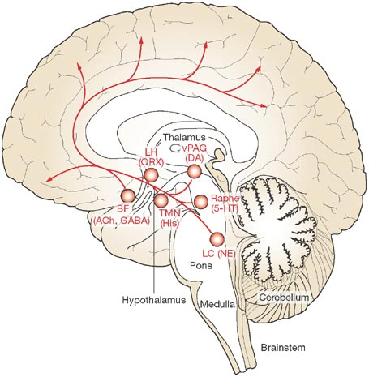
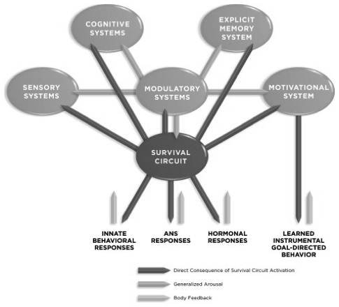
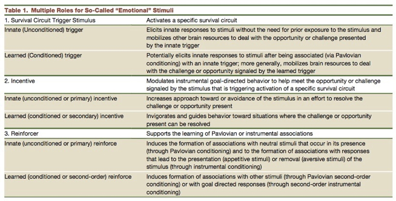
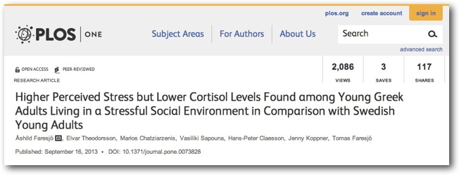

```{r, echo=FALSE}
knitr::opts_chunk$set(echo = FALSE, warning = FALSE, message = FALSE,
                      fig.align = "center")
```

---

<iframe width="560" height="315" src="https://www.youtube.com/embed/yRUAzGQ3nSY" frameborder="0" allow="accelerometer; autoplay; encrypted-media; gyroscope; picture-in-picture" allowfullscreen></iframe>

2:25
<!-- Inside Out Trailer -->

## Announcements

- Quiz 3 today, after class until 10 pm
- Exam 3 next Thursday, March 31

## Today's Topics

- Wrap up on [schizophrenia](https://psu-psychology.github.io/psych-260-2022-spring/lectures/260-2022-03-17-schizophrenia.html#29)
- Biology of emotion
- Happiness/pleasure and reward
- Fear & stress

## Biology of Emotion

- What is emotion?
- What are the types of emotions?
- Biological systems involved in emotion

## What is emotion?

- Feelings
- Physiological state

## Emotions as actions

<https://www.biomotionlab.ca/html5-bml-walker/>

## What is cause? What is effect?

> "Do we run from a bear because we are afraid or are we afraid because we run? William James posed this question more than a century ago, yet the notion that afferent visceral signals are essential for the unique experiences of distinct emotions remains a key unresolved question at the heart of emotional neuroscience."

[[@Harrison2010-nx]](http://doi.org/10.1523/JNEUROSCI.1725-10.2010)

## Competing views

- James-Lange
    - Physiological response -> subjective feelings
- Cannon-Bard
    - Severing CNS (spinal cord & vagus, Xth n) from rest of body leaves emotional expression unchanged
    - Physiological states slow, don't differentiate among emotions
    
## Competing views

- Schacter-Singer
    - Physiological arousal + cognitive appraisal -> emotional states

## What are the different types of emotions?

```{r, out.height="500px", fig.cap="[@plutchik1980emotion]"}
knitr::include_graphics("https://upload.wikimedia.org/wikipedia/commons/thumb/c/ce/Plutchik-wheel.svg/1200px-Plutchik-wheel.svg.png")
```

## Emotions

- Vary in <span class="blue">valence</span>
    + Positive/negative
- Vary in <span class="blue">intensity</span> (arousal)
- Vary in <span class="blue">action tendency</span>
    + Approach/avoid

## Emotions (can) serve biological goals

- Ingestion
- Defense
- Reproduction

- Affiliation

---

```{r, out.height="500px", fig.cap="[@plutchik1980emotion]"}
knitr::include_graphics("https://upload.wikimedia.org/wikipedia/commons/thumb/c/ce/Plutchik-wheel.svg/1200px-Plutchik-wheel.svg.png")
```

## Is emotion distinct from cognition?

<div class="centered">


[[@pessoa_relationship_2008]](http://dx.doi.org/10.1038/nrn2317)
</div>

## [[@pessoa_relationship_2008]](http://dx.doi.org/10.1038/nrn2317)

<div class="centered">
*Here, I will argue that complex cognitive–emotional behaviours have their basis in dynamic coalitions of networks of brain areas, none of which should be conceptualized as specifically affective or cognitive. Central to cognitive–emotional interactions are brain areas with a high degree of connectivity, called hubs, which are critical for regulating the flow and integration of information between regions.*
</div>

## [[@pessoa_relationship_2008]](http://dx.doi.org/10.1038/nrn2317)

<div class="centered">
*Here, I will argue that complex cognitive–emotional behaviours have their basis in dynamic coalitions of networks of brain areas, <span class="blue">none of which should be conceptualized as specifically affective or cognitive</span>. Central to cognitive–emotional interactions are brain areas with a high degree of connectivity, called hubs, which are critical for regulating the flow and integration of information between regions.*
</div>

## Emotion as "computing" (or information processing)

- Input
    - Internal states
    - External world
- Processing/evaluation
- Output
    - Internal states
    - External world
    
    
## *Where* in the brain is emotion processed? {.smaller}

```{r, out.height="450px", fig.cap="[[@Lindquist2012-jr]](http://dx.doi.org/10.1017/S0140525X11000446)"}
knitr::include_graphics("https://static.cambridge.org/binary/version/id/urn:cambridge.org:id:binary:20170929031912583-0602:S0140525X11000446:S0140525X11000446_fig1g.jpeg")
```

## Locationist account

> Figure 1. Locationist Hypotheses of Brain–Emotion Correspondence. A: Lateral view. B: Sagital view at the midline. C: Ventral view. D: Coronal view. Brain regions hypothesized to be associated with emotion categories are depicted. Here we depict the most popular locationist hypotheses, although other locationist hypotheses of brain–emotion correspondence exist (e.g., Panksepp, Reference Panksepp 1998). Fear: amygdala (yellow); Disgust: insula (green); Anger: OFC (rust); Sadness: ACC (blue). A color version of this image can be viewed in the online version of this target article at http://www.journals.cambridge.org/bbs.
>
> [[@Lindquist2012-jr]](http://dx.doi.org/10.1017/S0140525X11000446)

## Constructionist account

> A psychological constructionist account of emotion assumes that emotions are psychological events that emerge out of more basic psychological operations that are not specific to emotion. In this view, mental categories such as anger, sadness, fear, et cetera, are not respected by the brain (nor are emotion, perception, or cognition, for that matter).
>
> [[@Lindquist2012-jr]](http://dx.doi.org/10.1017/S0140525X11000446)

---

> ...emotions emerge when people make meaning out of sensory input from the body and from the world using knowledge of prior experiences. Emotions are “situated conceptualizations” (cf. Barsalou 2003) because the emerging meaning is tailored to the immediate environment and prepares the person to respond to sensory input in a way that is tailored to the situation,
>
> [[@Lindquist2012-jr]](http://dx.doi.org/10.1017/S0140525X11000446)


# Happiness and reward

## Components of happiness

- [Aristotle](http://plato.stanford.edu/entries/aristotle-ethics/)
- Hedonia
    + Pleasure
- Eudaimonia
    + Life satisfaction
    + Relates to motivation

## "Computing" pleasure

- Inputs
    + External
    + Internal
- Processing
- Outputs
    + Feelings
    + Actions

## Brain mechanisms

- Circuits for signaling pleasure and pain
- Similarities across animal species
    - Behavior & brain
- Dopamine and endogenous opioid neurotransmitter systems involved

## Neuroanatomy of pleasure {.smaller}

<div class="centered">


[[@kringelbach2009towards]](http://dx.doi.org/10.1016/j.tics.2009.08.006)
</div>

## Rewards

- A *reward* reinforces (makes more prevalent/probable) some behavior
- Milner and Olds [[@milner_discovery_1989]](http://doi.org/10.1016/S0149-7634(89)80013-2) discovered 'rewarding' power of electrical self-stimulation
- [[@heath1963electrical]](http://doi.org/10.1176/ajp.120.6.571) studied effects in human patients.

## Electrical self-stimulation

<iframe width="420" height="315" src="https://www.youtube.com/embed/de_b7k9kQp0" frameborder="0" allowfullscreen></iframe>

## "Reward" circuitry in the brain {.smaller}

<div class="centered">


[[@nestler2006mesolimbic]](http://dx.doi.org/10.1016/j.biopsych.2005.09.018)
</div>

## Nodes in the "reward" circuit

- Ventral tegmental area (VTA) in midbrain
- Nucleus accumbens (nAcc), ventral striatum
- Hypothalamus (Hyp)
- Amygdala (Amy)
- Hippocampus (HP)
- Dorsal Raphe Nucleus/Locus Coeruleus (DR/LC)
- Prefrontal cortex (PFC)

## Nucleus accumbens and dorsal striatum {.smaller}

<div class="centered">


[[@kohls2012social]](http://dx.doi.org/10.1186/1866-1955-4-10)
</div>

## Psychopharmacology of 'happiness'

- Dopamine
- Serotonin, Norepinephrine
- ACh

## ACh projections in the CNS {.smaller}

<div class="centered">


[[@cock_sleep_2008]](http://dx.doi.org/10.1038/ncpneuro0775)
</div>

## Brain contains its own systems for binding drugs associated with 'pleasure'

- <span class="blue">Endorphins</span>: Endogenous morphine-like compounds
    - e.g., morphine, heroin, oxycontin (oxycodone) are opioids
    
---

```{r, out.height="450px", fig.cap="[[@clapp-niaa]](http://pubs.niaaa.nih.gov/publications/arh314/310-339.htm)"}
knitr::include_graphics("img/endorphins-niaa.gif")
```

## Comparative risk

> "*A comparative risk assessment of drugs including alcohol and tobacco using the margin of exposure (MOE) approach was conducted. The MOE is defined as ratio between toxicological threshold (benchmark dose) and estimated human intake. Median lethal dose values from animal experiments were used to derive the benchmark dose. The human intake was calculated for individual scenarios and population-based scenarios...*"
>
> [[@Lachenmeier2015-mm]](http://dx.doi.org/10.1038/srep08126")

---

> "*...For individual exposure the four substances <span class="blue">alcohol, nicotine, cocaine and heroin fall into the “high risk” category</span> with MOE < 10, the rest of the compounds except THC fall into the “risk” category with MOE < 100.*"
>
> [[@Lachenmeier2015-mm]](http://dx.doi.org/10.1038/srep08126")

## Brain contains its own systems for binding drugs associated with 'pleasure'
 
- Endogenous cannabinoids
    - Cannabinoids == psychoactive compounds found in cannibis
    - Cannabinoid receptors: CB1 in CNS; CB2 in body, immune system
    
---

<div class="centered">


[[@flores_cannabinoid-hypocretin_2013]](http://dx.doi.org/10.3389/fnins.2013.00256)
</div>

## Generalizations about happiness/pleasure

- Types of pleasure activate overlapping areas
- Pleasure/happiness engage a network of brain areas
- Pleasure/happiness signaling involves multiple neuromodulators, but DA especially important
- “Reward” pathways activated by many different inputs
- Some exogenous substances bind to endogenous receptor systems

# Fear and stress

## Inducing "fear-like" behavior in animals {.smaller}

<div class="centered">


<http://www.cns.nyu.edu/labs/ledouxlab/images/image_research/fear_conditioning.jpg>
</div>

## Rat vs. Human {.smaller}

<div class="centered">


Adapted from [[@davis1992role]](http://dx.doi.org/10.1016/0165-6147(92)90014-W)
</div>

## Amygdala circuits {.smaller}

<div class="centered">


[[@medina2002parallels]](http://dx.doi.org/10.1038/nrn728)
</div>

## Amygdala's inputs

- Convergent inputs
    + Thalamus ("direct" or "fast"")
    + Cerebral cortex ("indirect" or "slow")

## Amygdala's outputs

- Project to
    + CG (central gray matter) of tegmentum: behavior
    + LH (lateral hyp): ANS
    + PVN (paraventricular n. of hyp): hormones
- Fast-acting, involuntary responses
- Lesions of amygdala impair 'fear conditioning'

## Cerebral cortex role

- Response discrimination?
    + Cortex lesions cause generalized not cue-specific fear response 
- Fast, crude responses vs. slower, detailed ones
    + That’s a stick, not a snake!
    + Prefrontal cortex and response inhibition

## But, are we really studying learned 'fear'?

- Amygdala connected to other 'affective' nodes in neural network
- Emotion not just about subjective feelings

## Amygdala as processing hub {.smaller}

<div class="centered">


[[@pessoa_relationship_2008]](http://dx.doi.org/10.1038/nrn2317)
</div>

## Amygdala as key hub in circuit for survival {.smaller}

<div class="centered">


[[@ledoux_rethinking_2012]](http://dx.doi.org/10.1016/j.neuron.2012.02.004)
</div>

## Emotion as global physiological/behavioral "state" {.smaller}

<div class="centered">


[[@ledoux_rethinking_2012]](http://dx.doi.org/10.1016/j.neuron.2012.02.004)
</div>

<!-- ## "Emotional" stimuli serve multiple roles {.smaller} -->

<!-- <div class="centered"> -->
<!--  -->

<!-- [[@ledoux_rethinking_2012]](http://dx.doi.org/10.1016/j.neuron.2012.02.004) -->
<!-- </div> -->

## Stress {.smaller}

<div class="centered">

</div>

## Stressors linked with biological imperatives

- Sustenance
    + Hunger, thirst
- Well-being/defense
    + Threat
    
## Stressors linked with biological imperatives

- Reproduction
    + Rejection
- Affiliation
    + Loneliness
     
## Stress and the brain {.smaller}

<div class="centered">


[[@mcewen_physiology_2007]](http://dx.doi.org/10.1152/physrev.00041.2006)
</div>

## Regulating internal states

- Homeostasis
    - Regulation of physiological variables (blood $O_2$) via negative feedback, [[@Cannon1929-ij]](https://doi.org/10.1152/physrev.1929.9.3.399)
- Allostasis
    - Regulation is active process, anticipatory, varies by circumstance, target levels also vary
- [@Sterling1988-di], [[@Ramsay2014-la]](http://dx.doi.org/10.1037/a0035942)

## Brain under stress 

- **Acute** stress
    + Short duration
    + Fast action required
    + HPA (Cortisol), SAM (NE/Epi) axes
- Brain detects threat
- Mobilizes physiological, behavioral responses

## Brain under stress

- vs. **Chronic** stress
    + Long duration, persistent
    
## Glucocorticoids

- Adrenal cortex releases hormones
    + Cortisol (hydrocortisone)
        * Increases blood glucose levels
        * Suppresses immune system
        * Reduces inflammation
        * Aids in metabolism
    + Receptors in brain and body
    
## Cortisol and the brain {.smaller}

<div class="centered">


<http://www.molecularbrain.com/content/figures/1756-6606-3-2-1-l.jpg>
</div>

## Glucocorticoid cascade hypothesis

- Cort receptors in hippocampus, amygdala, hypothalamus
    - Hippocampus regulates HPA axis via hypothalamus
- Prolonged cortisol exposure reduces hippocampus response
    - Reduces volume, connectivity in hippocampus
- Hip critical for long-term memory formation
    - Chronic stress impairs long-term memory

## But, cortisol -> stress link not straightforward {.smaller}

<div class="centered">


[[@faresjo_higher_2013]](http://dx.doi.org/10.1371/journal.pone.0073828)
</div>

## Stress and coping across the animal kingdom

- Pain thresholds lower (sensitivity greater) when a mouse's cage mate is also in pain
- Rats will cooperate to release distressed cage mate, foregoing food rewards
- [[@sapolsky_psychiatric_2016]](http://doi.org/10.1038/nn.4397)

## Why Zebras Don't Get Ulcers

<div class="centered">

</div>

## Your (zebra) stress ain't like mine

- Phasic (short-term) vs. chronic (long-term)
- Physical stress (hunger, thirst, injury, disease) vs. social stress

## Main points

- Biological approach to emotion
    + Behavior
    + Physiological states
    + Subjective feelings
    + Adaptive function
- Networks of brain systems, multiple NT systems

## References {.smaller}
