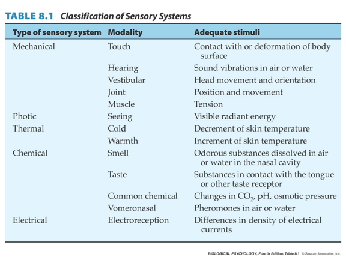
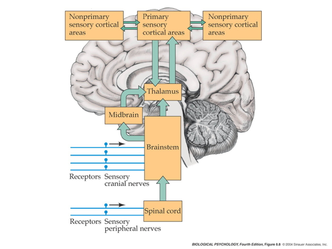

```{r, echo=FALSE}
knitr::opts_chunk$set(echo = FALSE, warning = FALSE, message = FALSE,
                      fig.align = "center")
```

## Prelude (4:56)

<iframe width="560" height="315" src="https://www.youtube.com/embed/tFN5DveQH0o" frameborder="0" allowfullscreen></iframe>

<!-- The Police - King of Pain -->

## Announcements

- Exam 3 this Thursday

## Today's Topics

- Sensory systems
- Somatosensation
- Pain

# Sensory systems

## My smartphone and me...

<div class="centered">

</div>

## Let's design the Galaxy 20/iPhone XX

- What information do your users need to acquire? 
- Why do they need to know it? In what context, for what purpose?
- What types of information does your device need to gather, through which channels?

## Multisensory processing in a smartphone {.smaller}

- Accelerometer
- Gyroscope
- Magnetometer
- Proximity sensor
- Ambient light sensor
- Barometer

<http://www.phonearena.com/news/Did-you-know-how-many-different-kinds-of-sensors-go-inside-a-smartphone_id57885>

## Multisensory processing in a smartphone {.smaller}

- Thermometer
- Mic
- Camera
- Radios (Bluetooth, wifi, cellular, GPS)

<http://www.phonearena.com/news/Did-you-know-how-many-different-kinds-of-sensors-go-inside-a-smartphone_id57885>

## My turn...

- What information do **I** need to acquire? 
- Why do **I** need to know it? In what context & for what purpose?
- What types of information do **I** need to gather, through which channels?

## Dimensions of sensory processing

- *Interoceptive*
    + How am I?
- *Exteroceptive*
    + What's in the world, where is it?
    
## Questions for interoception: How are you?

>- Tired or rested?
>- Well or ill?
>- Hungry or thirsty or sated?
>- Stressed vs. coping?
>- Emotional state?
>- Where are you?

## Questions for exteroception

- Who/What is out there?
- Where is it?

## Mrs. Potraz was wrong...there aren't 5 senses

<div class="centered">

</div>

## How sensory channels differ

- What is the energy/chemical source?
- How does the channel inform...
    + What's there?
    + Where's it located or moving?
    
<!-- ## Features of sensory signals -->

<!-- - Tonic (sustained) vs. phasic (transient) responses  -->
<!-- - Adaptation -->
<!--     + Decline in sensitivity with sustained stimulation  -->
<!--     + Most sensory systems attuned to change -->
<!-- - Information propagates at different speeds -->

<!-- ## Common principles -->

<!-- - Sensors detect repeating signals -->
<!--     + In space (textures) -->
<!--     + In time -->

<!-- ## Spatial frequency/contrast sensitivity {.smaller} -->

<!-- <div class="centered"> -->
<!--  -->

<!-- <http://fourier.eng.hmc.edu/e180/lectures/figures/csf_image.gif> -->
<!-- </div> -->

<!-- ## Frequencies in sound {.smaller} -->

<!-- <div class="centered"> -->
<!--  -->

<!-- <http://hearinghealthmatters.org/waynesworld/files/2012/06/Fourier-Analysis.gif> -->
<!-- </div> -->

<!-- ## Common principles -->

<!-- - Compare (>1) sensor for each channel -->
<!--     + Eyes -->
<!--     + Ears -->
<!--     + Nostrils -->
<!--     + Skin surface -->

<!-- ## Why is the snake's tongue forked? {.smaller} -->

<!-- <div class="centered"> -->
<!--  -->

<!-- <https://www.captivatingthinking.com/wp-content/uploads/2018/02/Snake-Tongue-1.jpeg> -->
<!-- </div> -->

<!-- ## Common principles -->

<!-- - Sensory neurons have ["receptive fields"](https://en.wikipedia.org/wiki/Receptive_field) -->
<!--     + Area on sensory surface that when stimulated changes neuron's firing -->

<!-- ## Tactile receptive field -->

<!-- <div class="centered"> -->
<!--  -->
<!-- </div> -->

<!-- ## Visual receptive field {.smaller} -->

<!-- <div class="centered"> -->
<!--  -->

<!-- <https://classconnection.s3.amazonaws.com/594/flashcards/1450594/png/untitled_picture51356035996428.png> -->
<!-- </div> -->

<!-- ## Common Principles -->

<!-- - Topographic maps -->

<!-- ## Tonotopic (frequency) maps in auditory cortex {.smaller} -->

<!-- <div class="centered"> -->
<!--  -->

<!-- <http://www.his.kanazawa-it.ac.jp/~tomi/public/MEGLab/Auditory/tonotopy.gif> -->
<!-- </div> -->

<!-- ## Retinotopic maps in visual cortex {.smaller} -->

<!-- <div class="centered"> -->
<!--  -->

<!-- <https://en.wikipedia.org/wiki/Retinotopy> -->
<!-- </div> -->

<!-- ## Common principles -->

<!-- - Non-uniform sensitivity -->

<!-- ## Two-point touch thresholds {.smaller} -->

<!-- <div class="centered"> -->
<!--  -->

<!-- <http://jov.arvojournals.org/data/Journals/JOV/933499/jov-3-10-1-fig001.jpeg> -->
<!-- </div> -->

<!-- ## Acuity (vision for details) varies across visual field {.smaller} -->

<!-- <div class="centered"> -->
<!--  -->

<!-- <https://upload.wikimedia.org/wikipedia/commons/thumb/2/27/AcuityHumanEye.svg/270px-AcuityHumanEye.svg.png> -->
<!-- </div> -->

<!-- ## Hearing threshold varies across frequency {.smaller} -->

<!-- <div class="centered"> -->
<!--  -->

<!-- [(Park et al., 2016)](http://dx.doi.org/10.1371/journal.pone.0150783) -->
<!-- </div> -->

<!-- ## Hierarchical processing -->

<!-- <div class="centered"> -->
<!--  -->
<!-- </div> -->

<!-- ## Hierarchical processing -->

<!-- - Sensors (retina, skin, cochlea) to -->
<!-- - Thalamus to -->
<!-- - Cerebral cortex -->

<!-- ## Parallel processing -->

<!-- <div class="centered"> -->
<!--  -->
<!-- </div> -->

<!-- ## Parallel processing -->

<!-- <div class="centered"> -->
<!--  -->
<!-- </div> -->

<!-- ## Parallel processing -->

<!-- - Different types of information carried in different channels -->
<!--     - Light touch vs. pressure -->
<!--     - Pain vs. temperature -->

# Somatosensation

## What is somatosensation

- Sensations about the body

## Types of somatosensation

- Internal (interoceptive)
    + Where am I?  How do I feel?
    + Proprioception (perception of the self)
- External (exteroceptive)
    + What’s in the world?
    + Where is it?

## Internal senses

- Vestibular sense
    + Head position (relative to gravity)
    + Head movement (rotation, translation)

----

<iframe width="560" height="315" src="https://www.youtube.com/embed/j_R0LcPnZ_w" frameborder="0" allowfullscreen></iframe>

----

<div class="centered">

</div>

## Vesibulo-ocular response (VOR)

- Keeps eyes steady when head moves
- Can't walk & text without it

---

<iframe width="560" height="315" src="https://www.youtube.com/embed/ynvd70b-uCY?start=35" title="YouTube video player" frameborder="0" allow="accelerometer; autoplay; clipboard-write; encrypted-media; gyroscope; picture-in-picture" allowfullscreen></iframe>

<!-- Walking & texting video -->
    
## Internal senses

- Kinesthesia
    + Body position
    + Movement 
- Pain

## External senses

- Cutaneous senses (touch)
    + Hot, cold
    + Pressure
    + Vibration
    + Damage (pain)
- Plus kinesthesia (why?)

## Cutaneous (in the skin) receptors

<div class="centered">

</div>

## Receptors specialize

<div class="centered">

</div>

---

<div class="centered">

</div>

## Combined thermo and chemo receptors

- Why are minty foods cool?
- Why are spicy foods hot?

## Combined thermo (heat/cold) and chemo receptors

- Menthol/mint receptor (CMR1)
    + Also signals "cool" temperatures
- Vanilloid Receptors (TrpV1/VR1, VRL1)
    + Respond to capsaicin (in peppers), allyl isothiocyanate (in mustard, wasabi)
    + Also signal "hot" temperatures
    
---

```{r, out.height="550px"}
knitr::include_graphics("https://www.savoryexperiments.com/wp-content/uploads/2020/12/Scoville-Heat-Scale-Savory-Experiments2.jpg")
```
    
## Menthol & vanilloid receptors

<div class="centered">

</div>

## Size/speed trade-off

<div class="centered">

</div>

## From skin to brain

- Cutaneous receptors
- Dorsal root ganglion
- Ventral posterior lateral thalamus
- Primary somatosensory cortex (S-I)
    + Post-central gyrus of parietal lobe
    
## Dermatomes

<div class="centered">

</div>
    
## Dermatomes

<div class="centered">

</div>

## Functional segregation

<div class="centered">

</div>

----

<div class="centered">

</div>

## Functional segregation

- Separate pathways for different information types
- Dorsal column/medial leminiscal pathway
    - Touch, proprioception
- Spinothalamic tract
    - Pain, temperature

## Somatatopic maps

<div class="centered">

</div>

## Non-uniform mapping of skin surface

<div class="centered">

</div>

## Non-uniform mapping of skin surface {.smaller}

<div class="centered">


<http://jov.arvojournals.org/data/Journals/JOV/933499/jov-3-10-1-fig001.jpeg>
</div>

---

<iframe width="560" height="315" src="https://www.youtube.com/embed/vX35WDJohFo" title="YouTube video player" frameborder="0" allow="accelerometer; autoplay; clipboard-write; encrypted-media; gyroscope; picture-in-picture" allowfullscreen></iframe>

## Columnar organization/functional segregation

<div class="centered">

</div>

## Phantom Limbs

<iframe width="420" height="315" src="https://www.youtube.com/embed/1mHIv5ToMTM" frameborder="0" allowfullscreen></iframe>

##  What/where

- Perceiving Where
    + Somatotopic maps -- where on skin
    + Kinesthesia -- configuration of limbs
- Perceiving What
    + Patterns of smoothness, roughness, shape, temperature
    
## Somatosensation in other animals

<div class="centered">

</div>

# Pain

## The neuroscience of pain

- *Nociceptors* (Latin *nocere* to harm or hurt) detect harmful or potentially harmful stimuli of varied types:
    - chemical
    - mechanical
    - thermal

## Nociception

- External
    - Skin, cornea (eye), mucosa
- Internal
    - Muscles, joints, bladder, gut

## Different types of nociceptors...

- metabolism (acidic pH, hypoxia, ...)
- cell rupture (ATP and glutamate)
- cutaneous parasite penetration (histamine)
- mast cell (white blood cell) activation (serotonin, bradykinin, ...)
- immune and hormonal activity (cytokines and somatostatin)
    
## Fast ($A\delta$) and slow ($C$) transmission to CNS

<div class="centered">

</div>

<!-- ## Thermal grill illusion -->

<!-- <iframe width="560" height="315" src="https://www.youtube.com/embed/otweN9sCSd8" frameborder="0" allowfullscreen></iframe> -->

<!-- --- -->

<!-- <div class="centered"> -->
<!--  -->
<!-- </div> -->

<!-- ## 'Cross-talk' between nociceptor channels -->

<!-- <div class="centered"> -->
<!-- <a href="https://www.nature.com/neuro/journal/v17/n2/full/nn.3629.html"> -->
<!--  -->
<!-- </a> -->
<!-- </div> -->

## Projection to brain via anterolateral system

<div class="centered">

</div>

---

<div class="centered">
<a href="https://www.nature.com/articles/nrn894#f1">

</a>

[[@Craig2002-ce]](http://doi.org/10.1038/nrn894)
</div>

## Key CNS nodes in network

- Periaqueductal grey (PAG) in midbrain
- Insular cortex (insula)
- Hypothalamus
- Amygdala

## Key CNS nodes in network

- Thalamus
    - Ventroposterior lateral nucleus
    - Ventroposterior medial nucleus
    - Ventromedial nucleus

---

<div class="centered">

</div>

---

<div class="centered">
<a href="https://www.nature.com/articles/nrn894#f1">

</a>

[[@Craig2002-ce]](http://doi.org/10.1038/nrn894)
</div>

## Pain in the brain {.smaller}

<div class="centered">
<a href="http://www.nejm.org/doi/10.1056/NEJMoa1204471">

</a>

[[@Wager2013-uw]](http://doi.org/10.1056/NEJMoa1204471)
</div>

## Pain in the brain


>"*...we used machine-learning analyses to identify a pattern of fMRI activity across brain regions — a neurologic signature — that was associated with heat-induced pain. The pattern included the <span class="blue">thalamus, the posterior and anterior insulae, the secondary somatosensory cortex, the anterior cingulate cortex, the periaqueductal gray matter, and other areas...</span>*"
>
>[[@Wager2013-uw]](http://doi.org/10.1056/NEJMoa1204471)

## Pain relief

- *Prostaglandins*
    - hormone-like effects, but released in many places
    - trigger vasodilation and inflammation

## Pain relief

- *Paracetymol (acetaminophen)*
    - Mechanism not fully understood
    - inhibits synthesis of prostaglandins via cyclooxygenase (COX) enzyme
    - may modulate endocannabinoid system
- *Nonsteroidal anti-inflamatory drugs (NSAIDs)*: aspirin, ibuprofen
    - Also inhibit prostaglandins via COX

## Pain relief

- *Opioids*
    - Activate endogenous opioid systems
    - multiple receptor types ($\delta$, $\kappa$, $\mu$,...)
    - peripheral sensory neurons, amygdala, hypothalamus, PAG, spinal cord, cortex, medulla, pons,...
    - brainstem opioid neurons provide *descending* inhibition of nociceptors
    
---

<div class="centered">

</div>

---

<div class="centered">

</div>
    
## Pain relief

- *Capsaicin*
    - Binds to TrpV1/VR1 thermo/nociceptors
    - Eventually causes decrease in TrpV1 response
    - Alters how peripheral neuron responds to mechanical stimulation
    - [[@Borbiro2015-ik]](http://doi.org/10.1126/scisignal.2005667)
    
## Pain relief

- Why rubbing can help

<div class="centered">

</div>

## Gate control theory [@Melzack1965-va] {.smaller}

<p><a href="https://commons.wikimedia.org/wiki/File:Gate_control_no_A.svg#/media/File:Gate_control_no_A.svg"></a><br>By self - self-made in Inkscape, <a href="http://creativecommons.org/licenses/by/3.0" title="Creative Commons Attribution 3.0">CC BY 3.0</a>, <a href="https://commons.wikimedia.org/w/index.php?curid=3542661">Link</a></p>

## Gate control theory [@Melzack1965-va] {.smaller}

<p><a href="https://commons.wikimedia.org/wiki/File:Gate_control_A_firing.svg#/media/File:Gate_control_A_firing.svg"></a><br>By self - self-made in Inkscape, <a href="https://creativecommons.org/licenses/by-sa/3.0" title="Creative Commons Attribution-Share Alike 3.0">CC BY-SA 3.0</a>, <a href="https://commons.wikimedia.org/w/index.php?curid=3542671">Link</a></p>
    
## Psychological & physical components of pain {.smaller}

<div class="centered">


[[@Papini2015-ed]](http://dx.doi.org/10.1016/j.neubiorev.2014.11.012)
</div>

## Main points

- Somatosensation
    - Exteroception via
        - Cutaneous receptors + proprioception
    - Interoception via
        - Widely distributed receptors
        - Specific and non-specific

## Main points

- Pain
    - Multiple receptor channels
    - Highly interconnected CNS network
    - Multiple targets for modulation

## Next time...

- Exam 3

## References {.smaller}


